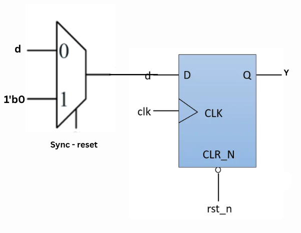

# 📘 Flop Coding Styles (Part 1)

### 1️⃣ What are Flip-Flops?

Flip-Flops (FFs) are simple storage elements that **hold one bit of data**.

Unlike combinational logic (which changes output immediately with inputs), FFs only change their output when the **clock signal** tells them to.

That’s why they are the **building blocks of memory, registers, and pipelines** in digital systems.


---

### 2️⃣ Types of Flip-Flops

There are different kinds of FFs, each with its own behavior:

- **D Flip-Flop** – captures input `D` on the clock edge.
- **JK Flip-Flop** – versatile, can set, reset, or toggle.
- **T Flip-Flop** – simply toggles the output every clock cycle.
- **SR Flip-Flop** – the simplest form, with set and reset controls.

---

### 3️⃣ Why Do We Need Flip-Flops? 🤔

- They **stabilize data** so it doesn’t keep changing randomly.
- They **synchronize signals** between different stages of logic.
- They help in **timing closure** by breaking long logic paths into smaller chunks.
    
    In short: without FFs, digital circuits would be unstable and unreliable.
    

    

---

### 4️⃣ The Problem of Glitches ⚡

When signals pass through combinational logic, different paths take **different times**.

This delay mismatch creates short, unwanted pulses on the output – called **glitches**.

👉 In the example shown, inputs `A`, `B`, and `C` change at slightly different times.

As a result, the output `Y` shows a **1 ns glitch** before settling.

Even though it’s tiny, such glitches can break a synchronous system if not handled.

---

### 5️⃣ How Flip-Flops Fix Glitches 🛡️

Here’s the magic: if you insert a flip-flop **between combinational blocks**, the glitch won’t pass through.

- The FF only updates at the **clock edge**.
- Any temporary spike before that is simply ignored.
- The output that goes forward is always **clean and stable**.

---

### 6️⃣ Flip-Flops as Guards ⏱️

Think of a flip-flop like a **gatekeeper**:

- The input (`D`) may be noisy or glitchy.
- But the output (`Q`) won’t change until the clock allows it.
- This makes FFs act as a **shield** that blocks glitches from propagating further.


---

# 📘 SKY130RTL D2SK3 L2 Why Flops and Flop coding styles part2

---

## 1️⃣ Set / Reset in Flip-Flops

Flip-Flops often include **Set (S)** and **Reset (R)** functionalities:

- **Set** → Forces output `Q = 1` regardless of input.
- **Reset** → Forces output `Q = 0` regardless of input.

### Types:

- **Synchronous Set/Reset** ⏱️ – Triggered only on the clock edge.
- **Asynchronous Set/Reset** ⚡ – Works immediately, independent of the clock.

 

---

## 2️⃣ Race Condition ⚠️


A **race condition** occurs when signals change at nearly the same time, creating **uncertainty** in the flip-flop output.

For example: if `D` and `Reset` change very close to the clock edge, the final state of `Q` becomes unpredictable.

👉 Careful coding styles and proper timing constraints are used to avoid race conditions.

---

## 3️⃣ Asynchronous Set Example 🔼


```verilog
module dff_async_set ( input clk , input async_set , input d , output reg q );
always @ (posedge clk , posedge async_set)
begin
	if(async_set)
		q <= 1'b1;   // Force output HIGH immediately
	else
		q <= d;      // Otherwise follow D
end
endmodule

```

✅ Behavior:

- If `async_set = 1`, output immediately becomes `1`.
- Otherwise, `Q` updates with `D` at the next clock edge.

---

## 4️⃣ Asynchronous Reset Example 🔽


```verilog
module dff_asyncres ( input clk , input async_reset , input d , output reg q );
always @ (posedge clk , posedge async_reset)
begin
	if(async_reset)
		q <= 1'b0;   // Force output LOW immediately
	else
		q <= d;      // Otherwise follow D
end
endmodule

```

✅ Behavior:

- If `async_reset = 1`, output immediately becomes `0`.
- Otherwise, `Q` updates with `D` at the next clock edge.

---

## 5️⃣ Combining Synchronous & Asynchronous Reset 🔄



```verilog
module dff_asyncres_syncres ( input clk , input async_reset , input sync_reset , input d , output reg q );
always @ (posedge clk , posedge async_reset)
begin
	if(async_reset)
		q <= 1'b0;   // Immediate reset
	else if (sync_reset)
		q <= 1'b0;   // Reset but only at clock edge
	else
		q <= d;      // Normal operation
end
endmodule

```

✅ Behavior:

- If **asynchronous reset** is active → `Q` resets immediately.
- If **synchronous reset** is active → `Q` resets only on the next clock edge.
- Otherwise, `Q` follows input `D`.

---

# 📘 SKY130RTL D2SK3 L2 Why Flops and Flop coding styles part2

**📌**  STEP 1: 

- **👉 Present working loction and its structure**

sky130RTLDesignAndSynthesisWorkshop/
├── DC_WORKSHOP
├── my_lib
│   ├── lib
│   │   └── sky130_fd_sc_hd__tt_025C_1v80.lib
│   └── verilog_model
├── verilog_files  **👉 Present working directory**

│   ├── dff_async_set.v
│   ├── dff_asyncres.v
│   ├── dff_asyncres_syncres.v

|    ├── tb_dff_async_set.v
|    ├── tb_dff_asyncres.v
|    ├── tb_dff_asyncres_syncres.v

## 1️⃣ Asynchronous Set Example 🔼

### **📌 Using iverilog run the following testbenches along with its RTL**

```verilog
iverilog dff_async_set.v tb_dff_async_set.v
./a.out
gtkwave tb_dff_async_set.vcd
```

### **📌**  tb_dff_async_set.v

```verilog
`timescale 1ns / 1ps
module tb_dff_async_set;
	// Inputs
	reg clk, async_set,   d;
	// Outputs
	wire q;

        // Instantiate the Unit Under Test (UUT)
	dff_async_set uut (
		.clk(clk),
		.async_set(async_set),
		.d(d),
		.q(q)
	);

	initial begin
	$dumpfile("tb_dff_async_set.vcd");
	$dumpvars(0,tb_dff_async_set);
	// Initialize Inputs
	clk = 0;
	async_set = 1;
	d = 0;
	#3000 $finish;
	end

always #10 clk = ~clk;
always #23 d = ~d;
always #547 async_set=~async_set;
endmodule

```

### 👾 OUTPUT WAVE FORM &  ELABORATED IMAGE

 

```verilog
yosys
read_liberty -lib ../lib/sky130_fd_sc_hd__tt_025C_1v80.lib
read_verilog dff_async_set.v
synth -top dff_async_set
abc -liberty ../lib/sky130_fd_sc_hd__tt_025C_1v80.lib
show
```

 

### 📝 Netlist

```verilog
write_verilog -noattr dff_async_set_netlist.v
nano dff_async_set_netlist.v
```

```verilog
/* Generated by Yosys 0.57+148 (git sha1 259bd6fb3, g++ 11.4.0-1ubuntu1~22.04.2 -fPIC -O3) */

module dff_async_set(clk, async_set, d, q);
  input clk;
  wire clk;
  input async_set;
  wire async_set;
  input d;
  wire d;
  output q;
  reg q;
  always @(posedge clk, posedge async_set)
    if (async_set) q <= 1'h1;
    else q <= d;
endmodule
```

---

## 2️⃣ Asynchronous Set Example 🔼

```verilog
iverilog dff_asyncres.v tb_dff_asyncres.v
./a.out
gtkwave tb_dff_asyncres.vcd
```

### **📌**  tb_dff_asyncres.v

```verilog

`timescale 1ns / 1ps
module tb_dff_asyncres;
	// Inputs
	reg clk, async_reset,   d;
	// Outputs
	wire q;

        // Instantiate the Unit Under Test (UUT)
	dff_asyncres uut (
		.clk(clk),
		.async_reset(async_reset),
		.d(d),
		.q(q)
	);

	initial begin
	$dumpfile("tb_dff_asyncres.vcd");
	$dumpvars(0,tb_dff_asyncres);
	// Initialize Inputs
	clk = 0;
	async_reset = 1;
	d = 0;
	#3000 $finish;
	end

always #10 clk = ~clk;
always #23 d = ~d;
always #547 async_reset=~async_reset;
endmodule

```

### 👾 OUTPUT WAVE FORM &  ELABORATED IMAGE


```verilog
yosys
read_liberty -lib ../lib/sky130_fd_sc_hd__tt_025C_1v80.lib
read_verilog dff_asyncres.v
synth -top dff_asyncres
abc -liberty ../lib/sky130_fd_sc_hd__tt_025C_1v80.lib
show
```


### 📝 Netlist

```verilog
write_verilog -noattr dff_asyncres_netlist.v
nano dff_asyncres_netlist.v
```

```verilog
/* Generated by Yosys 0.57+148 (git sha1 259bd6fb3, g++ 11.4.0-1ubuntu1~22.04.2 -fPIC -O3) */

module dff_asyncres(clk, async_reset, d, q);
  input clk;
  wire clk;
  input async_reset;
  wire async_reset;
  input d;
  wire d;
  output q;
  reg q;
  always @(posedge clk, posedge async_reset)
    if (async_reset) q <= 1'h0;
    else q <= d;
endmodule
```

---

## ****3️⃣ Asynchronous Set Example 🔼

```verilog
iverilog dff_asyncres_syncres.v tb_dff_asyncres_syncres.v
./a.out
gtkwave tb_dff_asyncres_syncres.vcd
```

### **📌** tb_dff_asyncres_syncres.v

```verilog
`timescale 1ns / 1ps
module tb_dff_asyncres_syncres;
	// Inputs
	reg clk, async_reset, sync_reset,  d;
	// Outputs
	wire q;

        // Instantiate the Unit Under Test (UUT)
	dff_asyncres_syncres uut (
		.clk(clk),
		.async_reset(async_reset),
		.sync_reset(sync_reset),
		.d(d),
		.q(q)
	);

	initial begin
	$dumpfile("tb_dff_asyncres_syncres.vcd");
	$dumpvars(0,tb_dff_asyncres_syncres);
	// Initialize Inputs
	clk = 0;
	async_reset = 1;
	sync_reset = 0;
	d = 0;
	#3000 $finish;
	end

always #10 clk = ~clk;
always #23 d = ~d;
always #113 sync_reset = ~sync_reset;
always #547 async_reset=~async_reset;
endmodule

```

### 👾 OUTPUT WAVE FORM &  ELABORATED IMAGE


```verilog
yosys
read_liberty -lib ../lib/sky130_fd_sc_hd__tt_025C_1v80.lib
read_verilog dff_asyncres_syncres.v
synth -top dff_asyncres_syncres
abc -liberty ../lib/sky130_fd_sc_hd__tt_025C_1v80.lib
show
```


### 📝 Netlist

```verilog
write_verilog -noattr dff_asyncres_syncres_netlist.v
nano dff_asyncres_syncres_netlist.v
```

```verilog

```

---

# 📘 **SKY130RTL D2SK3 L5 Interesting optimisations part1**

### **📌 mult_2.v**


```verilog
module mul2 (input [2:0] a, output [3:0] y);
    assign y = a * 2;
endmodule

```

This simple module multiplies a **3-bit input (`a`)** by 2 and produces a **4-bit output (`y`)**.

---

## 🔹 2. Truth Table 📊

| Input `a` (3-bit) | Decimal (a) | Output `y = a*2` (4-bit) | Decimal (y) |
| --- | --- | --- | --- |
| 000 | 0 | 0000 | 0 |
| 001 | 1 | 0010 | 2 |
| 010 | 2 | 0100 | 4 |
| 011 | 3 | 0110 | 6 |
| 100 | 4 | 1000 | 8 |
| 101 | 5 | 1010 | 10 |
| 110 | 6 | 1100 | 12 |
| 111 | 7 | 1110 | 14 |

✅ Observation: multiplying by **2** is the same as **left-shifting by 1 bit** (adding a `0` at the end).

---

## 🔹 3. Optimization Insight 💡

- `a * 2` ➝ simply append **one `0`** at the right (`a << 1`).
- `a * 4` ➝ append **two `0`s** (`a << 2`).
- In general:a∗2n=a<<n
    
    a∗2n=a<<na * 2^n = a << n
    

👉 This means **multiplication by powers of 2** doesn’t require extra multipliers — just bit-shifting, which is **hardware efficient** ⚡.

---

## 🔹 4. Yosys Commands 🛠️

To analyze this in the **open-source flow**, run:

```bash
yosys
read_liberty -lib ../lib/sky130_fd_sc_hd__tt_025C_1v80.lib
read_verilog mult_2.v
synth -top mul2
abc -liberty ../lib/sky130_fd_sc_hd__tt_025C_1v80.lib
show
```

- `read_verilog mult_2.v` → Loads our Verilog file.
- `synth -top mult_2` → Synthesizes the top module.
- `abc` → Optimizes using technology library.
- `show` → Visualizes the synthesized circuit.


✅ After synthesis, Yosys will **replace multiplication with shift logic**, showing how it optimizes hardware.

---

# 📘 **SKY130RTL D2SK3 L6 Interesting optimisations part2**

## Hardware-Friendly Multiplication Tricks in Synthesis

- Not all arithmetic operations need complex multipliers or large adders.
- For certain patterns, synthesis tools apply clever shortcuts that reduce logic drastically.
- Let’s explore two common cases: powers-of-two multiplication and multiplication by constants like 9.

---

## 1️⃣ Powers-of-Two Multiplication → Shift Shortcut 🔄

**Example: `mul2.v`**

```verilog
module mul2 (
    input [2:0] a,
    output [3:0] y
);
assign y = a * 2;
endmodule

```

Here, `a` is 3-bit and `y` is 4-bit. Instead of a full multiplier, synthesis tools recognize:

```verilog
y=a×2=a<<1y = a \times 2 = a << 1
```

```verilog
y=a×2=a<<1
```

This is a **simple left shift**—append one `0` at the least significant bit.

**Truth Table (3-bit `a` → 4-bit `y`):**

| Decimal a | Binary a | y = a*2 (Decimal) | Binary y |
| --- | --- | --- | --- |
| 0 | 000 | 0 | 0000 |
| 1 | 001 | 2 | 0010 |
| 2 | 010 | 4 | 0100 |
| 3 | 011 | 6 | 0110 |
| 4 | 100 | 8 | 1000 |
| 5 | 101 | 10 | 1010 |
| 6 | 110 | 12 | 1100 |
| 7 | 111 | 14 | 1110 |

✅ Output = **input shifted left**, i.e., `{a, 0}`.

**Optimized Verilog:**

```verilog
module mul2(a, y);
  input [2:0] a;
  output [3:0] y;
  assign y = { a, 1'b0 };
endmodule

```

### Quick Reference:

- ×2 → append 1 zero (`a << 1`)
- ×4 → append 2 zeros (`a << 2`)
- ×8 → append 3 zeros (`a << 3`)

💡 Shifts save **area**, **power**, and **timing** compared to multipliers.

---

## 2️⃣ Constant Multiplication → Decomposition Trick 🧩

**Example: `mult8.v`**

```verilog
module mult8 (
    input [2:0] a,
    output [5:0] y
);
assign y = a * 9;
endmodule

```

Instead of a multiplier, synthesis tools break it down:

```verilog
a×9=a×(8+1)=(a<<3)+aa \times 9 = a \times (8+1) = (a << 3) + a
```

```verilog
a×9=a×(8+1)=(a<<3)+a
```

**Optimized Verilog Output:**

```verilog
module mult8(a, y);
  input [2:0] a;
  output [5:0] y;
  assign y = { a, a };
endmodule

```

✅ `{a, a}` replicates `(a << 3) + a` using simple concatenation, no full multiplier needed.

---

## 🔹 Benefits of These Techniques ✨

1. **Smaller Footprint** – No large multipliers, just wiring or minimal adders.
2. **Lower Power Usage** ⚡ – Shift and concatenation are cheap compared to multipliers.
3. **Faster Operation** ⏱️ – Shift-based operations are faster than multiplier paths.
4. **Automatic Optimization** – Synthesis tools detect constant patterns and optimize efficiently.

**Summary Table:**

| Operation | RTL Expression | Synthesized Form | Hardware Used |
| --- | --- | --- | --- |
| ×2 | y = a*2 | y = {a, 0} | Shift left by 1 |
| ×4 | y = a*4 | y = {a, 00} | Shift left by 2 |
| ×8 | y = a*8 | y = {a, 000} | Shift left by 3 |
| ×9 | y = a*9 | y = {a, a} | Concatenate + Add |

---

# 👉 Vist the [DAY3] 🤩
