<h1 align="center">🌟 RISC-V SoC Tapeout – Week 1️⃣</h1>
<br><br>

<h2 align="center">🚀 Day 2 - Timing libs, hierarchical vs flat synthesis and efficient flop coding styles</h2>
<br>

##  Introduction to timing .libs
### 👉 SKY130RTL D2SK1 L1 Lab4 Introduction to .Lib part1

### 📌 What is a `.lib` file?

- **`.lib` (Liberty format)** → Text-based file describing the timing, power, and functional characteristics of standard cells. ”It’’s like  a DNA tha contanins all the information”
- Used by synthesis tools (like **Yosys**) and STA tools to **map RTL → gates**.
- Contains:
    - 🏗 **Functionality** → What the cell does (e.g., AND, OR, DFF).
    - ⚡ **Timing** → Delay, setup, hold, slew.
    - 🔋 **Power** → Switching & leakage power.
    - 📏 **Area** → How much silicon it occupies.

📂 **Example library file :**

```
sky130_fd_sc_hd__tt_025C_1v80.lib

```

---

### 🕵️ 2. Decoding the Library Name

| Segment | Meaning |
| --- | --- |
| `sky130` | SkyWater 130nm technology |
| `fd` | Foundry Design |
| `sc` | Standard Cells |
| `hd` | High Density (area-optimized) |
| `tt` | Process corner → Typical NMOS, Typical PMOS |
| `025C` | Temperature → 25 °C |
| `1v80` | Supply voltage = 1.80 V |

👉 It’s like a **passport for your cells** ✈️ — process, flavor, environment, all inside one name!

### 3. Library Flavors

Not all chips are built equal — you choose your **cell diet** 🍔:

- 🟦 **HD (High Density)** → Small, power-efficient, area-friendly.
- 🟥 **HS (High Speed)** → Bigger, faster, more power-hungry.
- 🟩 **LP (Low Power)** → Minimum leakage, battery-friendly

---

### 🌍 4. Corners (PVT) = Different Worlds

 📌 Your chip must **survive all environments** 🌦.

### P → Power

• During fabrication, NMOS and PMOS may turn out **faster or slower** than expected.

| Corner | NMOS | PMOS | Behavior |
| --- | --- | --- | --- |
| **TT** | Typical | Typical | Nominal case |
| **FF** | Fast | Fast | Low delay ⚡ (risk: hold issues) |
| **SS** | Slow | Slow | High delay 🐢 (risk: setup issues) |
| **FS** | Fast | Slow | Skewed condition |
| **SF** | Slow | Fast | Skewed condition |

### V → Voltage

• Supply voltage may not always be exactly **1.8 V** (in your SKY130 example).

### T → Temperature

• Transistors behave differently at **-40 °C, 25 °C, 125 °C**, etc.

---

> 💡 **Rule of Thumb:**
> 
> Worst delay → SS, low V, high T 🌡
> Best delay → FF, high V, low T ❄️

---

### 👉 SKY130RTL D2SK1 L2 Lab4 Introduction to  .Lib part2

### 📌 What is inside the `sky130_fd_sc_hd_tt_025C_1v80`?

### 1️⃣ General Library Info

- **Library Name:** `sky130_fd_sc_hd_tt_025C_1v80` 🏷️
- **Technology:** CMOS (130 nm) ⚡
- **Delay Model:** Table Lookup ⏱️
- **Bus Naming Style:** `%s[%d]` 🛣️
- **Revision:** 1.0 📄Operating Conditions
- **Corner:** Typical-Typical (TT) ✅
- Voltage: 1.8 V ⚡
- Temperature: 25 °C 🌤️
- Process: 1.0 🏭
- Tree type: balanced 🌳

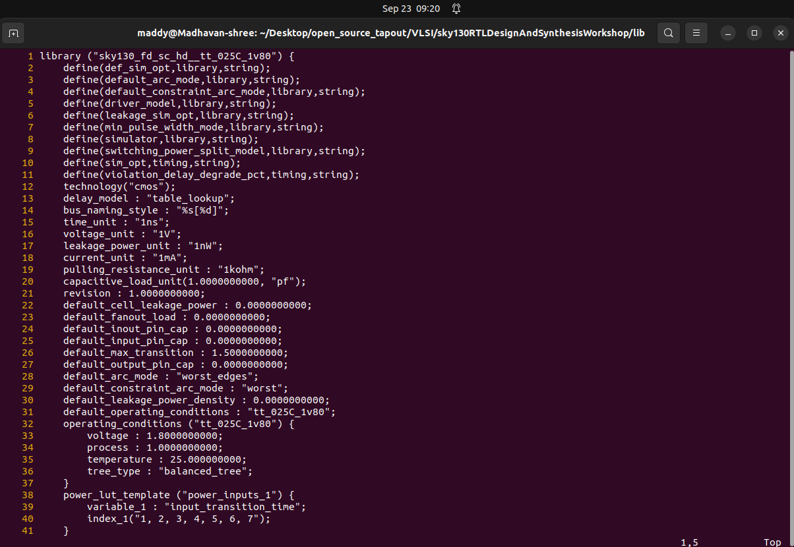

---

### 2️⃣ Cells & Gates 🧩

- **Timing Type:** Combinational 
- **Timing Sense:** Positive Unate ➕
- **Example Function:** `(A1 & A2) | (B1) | (C1) | (D1)`
- **Leakage Power:** Defined per logical condition 💧 (e.g., `0.0021893 nW for IA1 & !A2 & !B1 & !C18D1`)

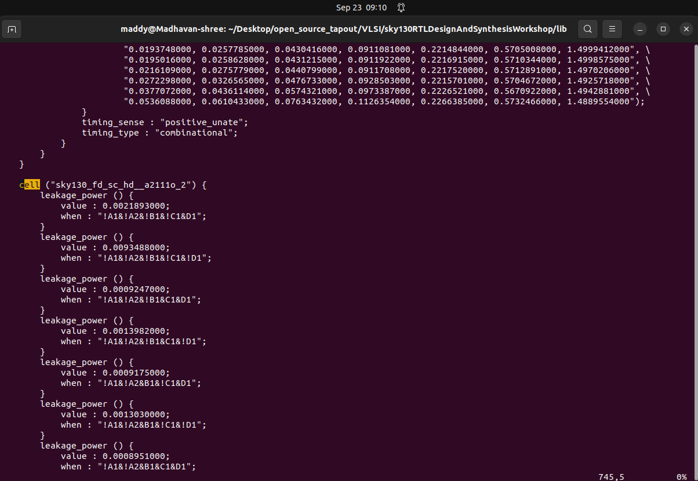
---

### 3️⃣ Power Info ⏱️

- **Max Capacitance:** 0.175 pF 
- **Max Transition:** 1.499 ns
- **Power Down Function:** `(IVPWR + VGND)` 
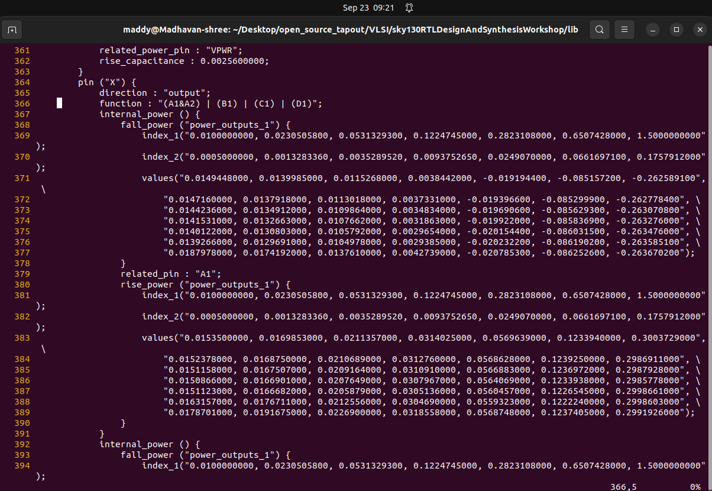
--- 
### 4️⃣ Timing Tables 📊

- **Cell Rise/Fall Delays:** Indexed per input/output condition
- **Fall Transition:** Values for STA 
- **Purpose:** Enables **Static Timing Analysis (STA)** 

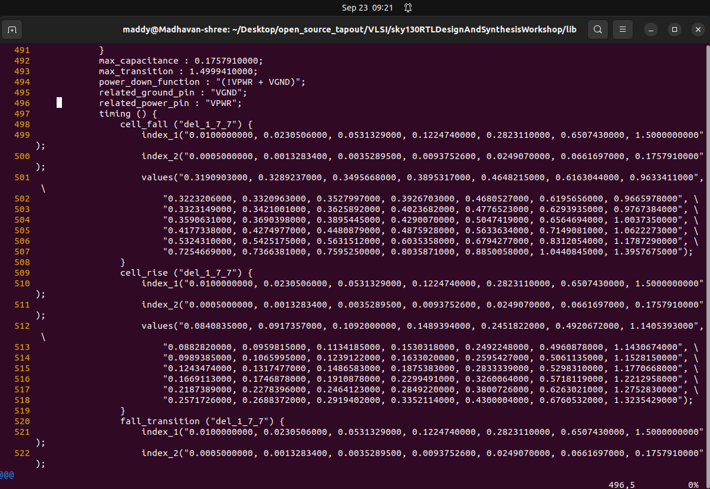
---

### 👉 SKY130RTL D2SK1 L2 Lab4 Introduction to  .Lib part2

### 📌 Wider Cells & PDK Characterization 🛠️

In standard cell libraries, **wider cells** are cells with larger transistor sizes designed to provide higher **drive strength**. Cell width directly impacts key parameters such as **area, speed, and power consumption**.

- ⚡ **Performance:** Wider cells drive larger loads faster → lower propagation delay.
- 📏 **Area:** Larger transistors → wider cells → more silicon usage.
- 🔋 **Power:** Both dynamic and leakage power increase with transistor size.

🟡  The different types of STD Cells will have different area, power,performance like we can see that via below image 

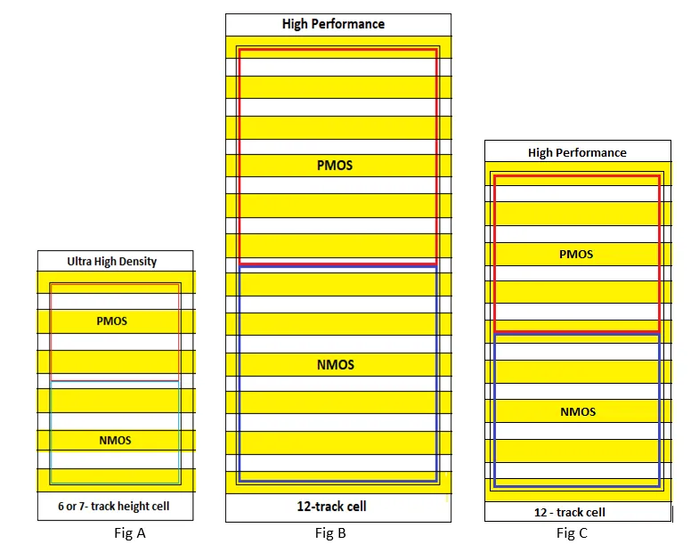

🟡  Comparing the different kinda STD Cells 

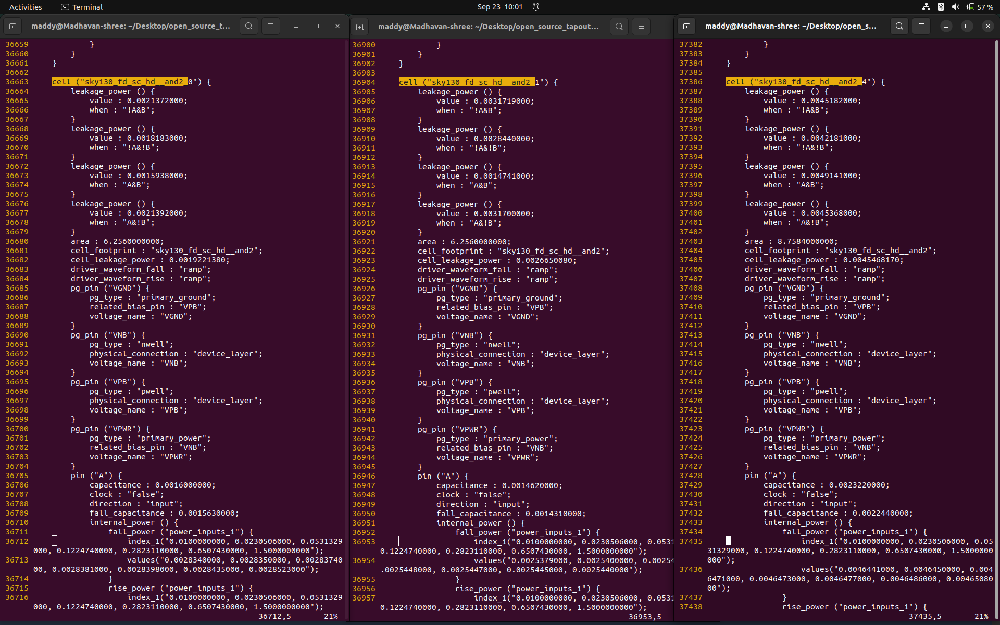

--- 
## **🏗️ Hierarchical vs Flat Synthesis – SKY130 RTL Design**

### **👉 SKY130RTL D2SK2 L1 Lab05 Hier synthesis flat synthesis part1**

### **1️⃣ Hierarchical Synthesis🌳**

- **Definition:** The design is synthesized **module by module**, respecting the hierarchy of RTL.
- **Pros:**
    - Easier to **debug and manage** large designs
    - **Faster incremental synthesis** when small modules change
    - Keeps **design hierarchy intact** → good for IP reuse
- **Cons:**
    - May lead to **suboptimal timing** across module boundaries
    - Slightly larger **area** due to isolated optimization per module

---

**🔴 Step 1: The RTL File we gona use**

```
module sub_module2 (input a, input b, output y);
    assign y = a | b;
endmodule

module sub_module1 (input a, input b, output y);
    assign y = a & b;
endmodule

module multiple_modules (input a, input b, input c, output y);
    wire net1;
    sub_module1 u1(.a(a), .b(b), .y(net1));  // net1 = a & b
    sub_module2 u2(.a(net1), .b(c), .y(y));  // y = net1 | c, i.e., y = a&b + c
endmodule

```

📂 **Files:** `multiple_modules.v`

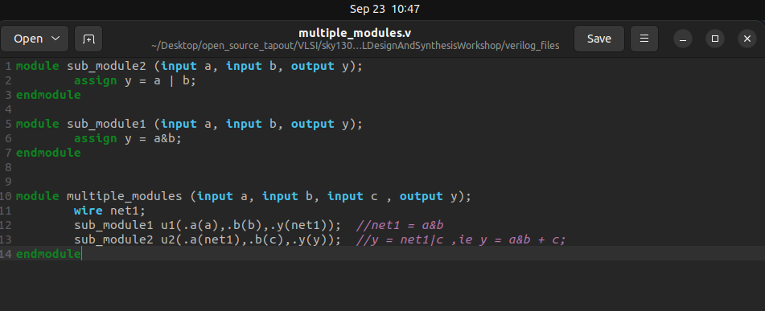

🔵 Visuaizing the RTL code

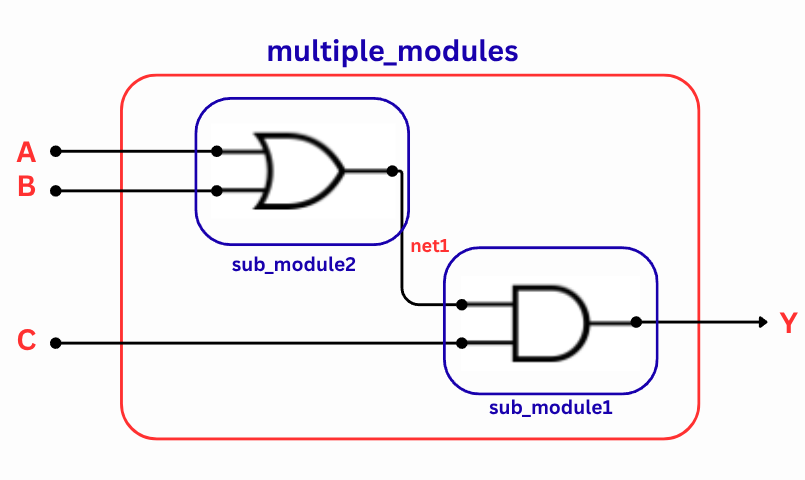

---

🔴 Open yosys and follow the commands

```
yosys
read_liberty -lib ../lib/sky130_fd_sc_hd__tt_025C_1v80.lib
read_verilog multiple_modules.v
synth -top multiple_modules
abc -liberty ../lib/sky130_fd_sc_hd__tt_025C_1v80.lib

```

🔵 We could able to see the Report of this RTL module

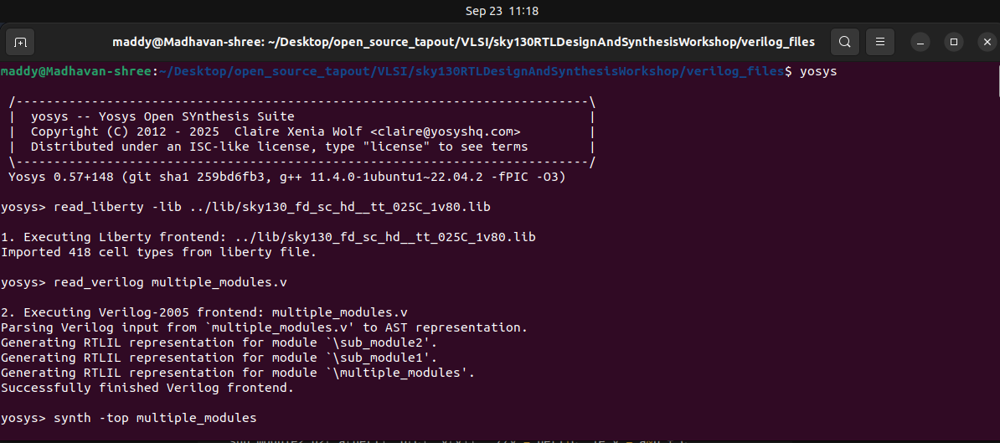

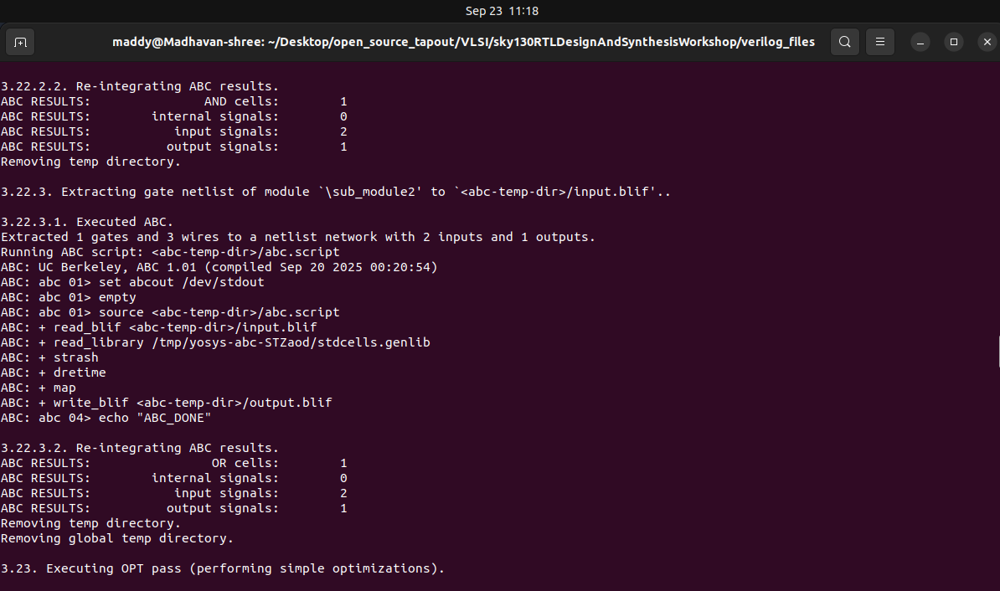

```
show multiple_modules.v
```

⚠️ **Observation:**

- Hierarchical design preserves **module names (U1, U2)**.
- Gates inside sub-modules (AND, OR) are abstracted in the hierarchy.

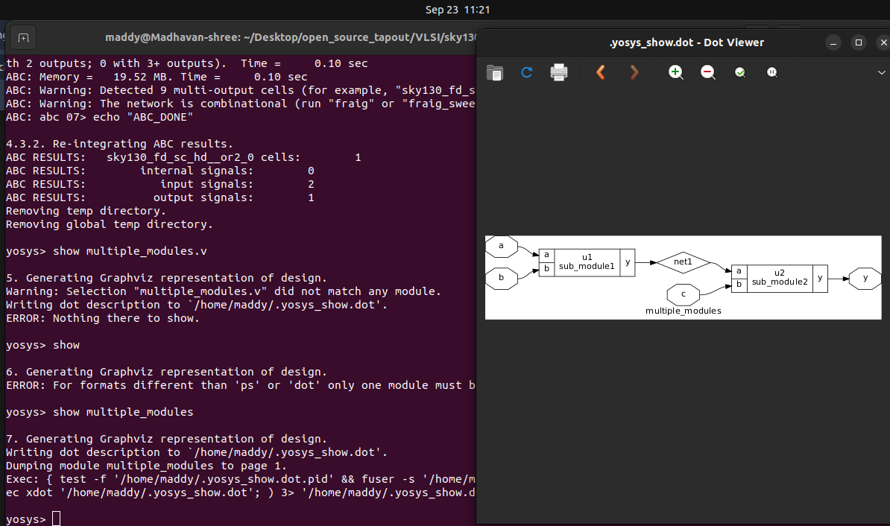

🔴 Export Hierarchical Verilog

```
write_verilog -noattr multiple_modules_hier.v
nano multiple_modules_hier.v
```


🔴 multiple_modules_hier.v 📂

```
/* Generated by Yosys 0.57+148 (git sha1 259bd6fb3, g++ 11.4.0-1ubuntu1~22.04.2 -fPIC -O3) */

module multiple_modules(a, b, c, y);
  input a;
  wire a;
  input b;
  wire b;
  input c;
  wire c;
  output y;
  wire y;
  wire net1;
  sub_module1 u1 (
    .a(a),
    .b(b),
    .y(net1)
  );
  sub_module2 u2 (
    .a(net1),
    .b(c),
    .y(y)
  );
endmodule

module sub_module1(a, b, y);
  input a;
  wire a;
  input b;
  wire b;
  output y;
  wire y;
  wire _0_;
  wire _1_;
  wire _2_;
  sky130_fd_sc_hd__and2_0 _3_ (
    .A(_1_),
    .B(_0_),
    .X(_2_)
  );
  assign _1_ = b;
  assign _0_ = a;
  assign y = _2_;
endmodule

module sub_module2(a, b, y);
  input a;
  wire a;
  input b;
  wire b;
  output y;
  wire y;
  wire _0_;
  wire _1_;
  wire _2_;
  sky130_fd_sc_hd__or2_0 _3_ (
    .A(_1_),
    .B(_0_),
    .X(_2_)
  );
  assign _1_ = b;
  assign _0_ = a;
  assign y = _2_;
endmodule
```

---

**🔵 Understanding the Netlist Behavior 💻**

- **Expected:** OR gate for `sub_module2` ➡️ `y = a | b`
- **Observed:** NAND + NOT gates ❌🔄
- **Reason:**
    - PMOS transistors stacked in OR implementations have **slow mobility** 🐢 → slower performance.
    - To improve timing and drive strength, synthesis tools **replace OR with NAND+NOT** 🔧 → creates a **wider cell** .

💡 **Concept:**

- Wider cells 📏 → bigger transistors → faster ⚡ but occupy **more area** 🏗️ and **consume more power** 🔋.
- Example of **tech-aware optimization** during synthesis 🛠️.

---

## **2️⃣ Flat Synthesis🌐**

- **Definition:** The entire design is **flattened into a single module** before synthesis.
- **Pros:**
    - **Global optimization** → better timing and power efficiency ⚡🔋
    - **Smaller area** since all modules are optimized together 📏
- **Cons:**
    - **Slower synthesis** for large designs 🐢
    - Harder to **debug and manage** due to loss of hierarchy
    - Incremental changes require **resynthesizing the whole design** 🔄

---

🔴 Open yosys and follow the commands

```bash
yosys
read_liberty -lib ../lib/sky130_fd_sc_hd__tt_025C_1v80.lib
read_verilog multiple_modules.v
flatten multiple_modules       # Remove hierarchy
synth -top multiple_modules
abc -liberty ../lib/sky130_fd_sc_hd__tt_025C_1v80.lib
write_verilog multiple_modules_flat.v
show multiple_modules_flat.v
```

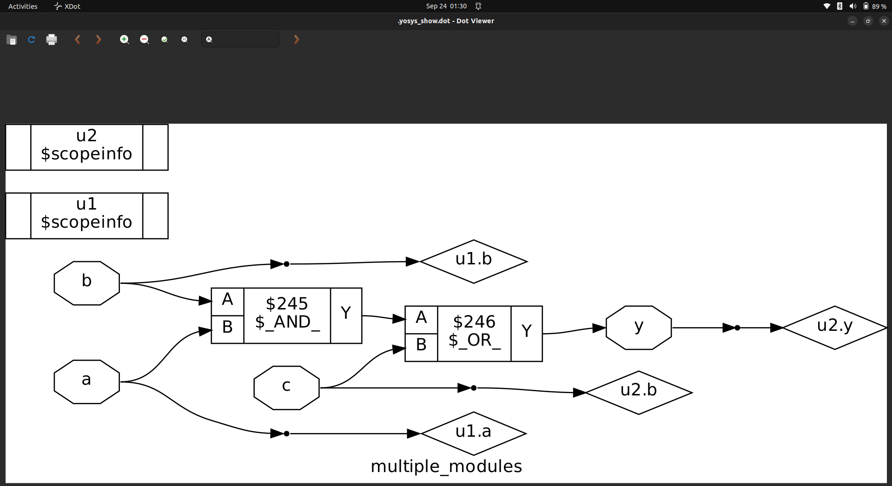

---

🔴 Open the top_module_flat.v to see the chnages 

```bash
nano multiple_modules_flat.v
```

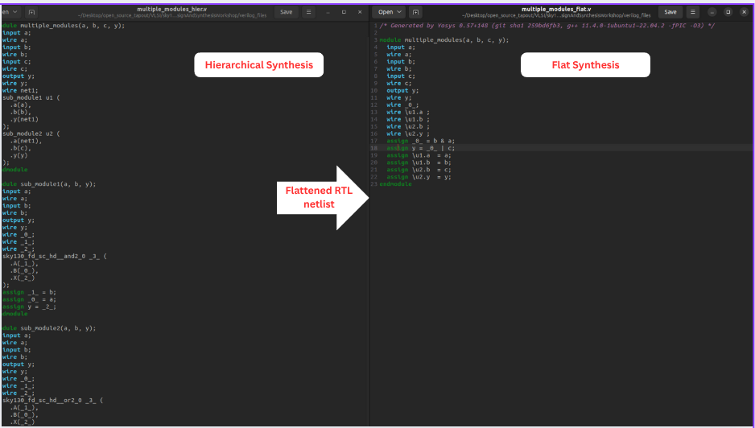

---

## **3️⃣ Sub module Synthesis 🧩**

### 🔹 what is it ?

- Synthesizes **each submodule independently**, keeping hierarchy intact.
- Submodules produce **modular netlists**, which are later integrated into top-level design.

### ⚡ Key Features

- Maintains **hierarchical boundaries**.
- Allows **module-specific optimizations** without affecting top-level design.
- Helps in **reuse of IPs** and easier verification.

### 🔴 Example

- `sub_module1` synthesized → AND gates
- `sub_module2` synthesized → OR gates
- `top_module` integrates them hierarchically.

### 💡 Pros & Cons

| Pros | Cons |
| --- | --- |
| Preserves hierarchy | May not achieve global optimal timing |
| Easier verification & debugging | Area/power may be slightly higher than fully flat synthesis |
| Supports reusable IPs | Requires multiple synthesis runs |

---

🔴 Open yosys and follow the commandsfor sub_module1

```bash
yosys
read_liberty -lib ../lib/sky130_fd_sc_hd__tt_025C_1v80.lib
read_verilog sub_module1.v
synth -top sub_module1
abc -liberty ../lib/sky130_fd_sc_hd__tt_025C_1v80.lib
write_verilog sub_module1_synth.v
```

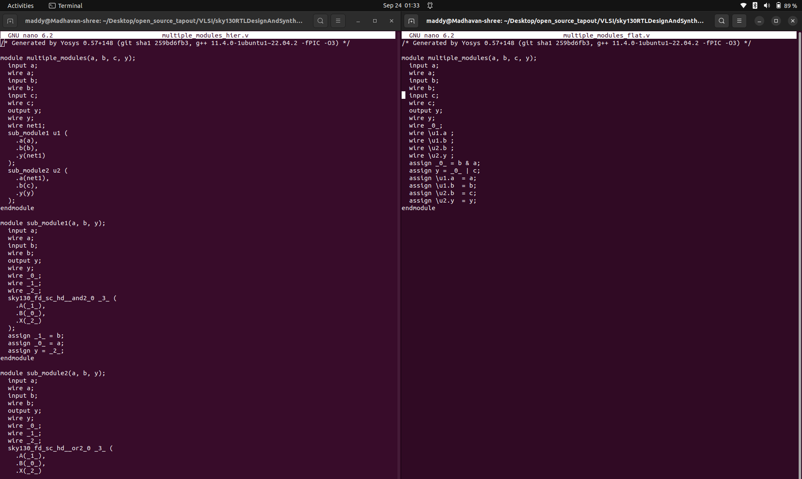

---

🔴 Open yosys and follow the commands for sub_module2

```bash
# Synthesize sub_module2 similarly
read_verilog sub_module2.v
synth -top sub_module2
abc -liberty ../lib/sky130_fd_sc_hd__tt_025C_1v80.lib
write_verilog sub_module2_synth.v
```

---

## **⚖️**  **Summary Table**: Hierarchical vs Flat vs Submodule

| Feature | Hierarchical | Flat | Submodule-Level |
| --- | --- | --- | --- |
| Hierarchy | Preserved | Removed | Preserved |
| Optimization Scope | Module-level | Global | Module-level |
| Readability | High | Low | High |
| Debugging | Easy | Hard | Easy |
| Reusability | Yes | No | Yes |
| Area/Performance | Moderate | Best | Moderate |

