<h1 align="center">🌟 Welcome to Sequential part 🌟</h1>


## 👉 SKY130RTL D3SK3 L1 – Lab07 Sequential Logic Optimisations (Part 1) ⚡

## 1️⃣ Introduction

**sequential optimization techniques**.

- We’ll be working with files named **`dff_const*.v`**.
- Each file has an associated with its corresponding **testbench (TB)** .
- Goal: Understand how **sequential constants** behave in synthesis and simulation.

---

## 2️⃣ Case 1 – `dff_const1.v`

- **Code Behavior**:

<p align="center">
  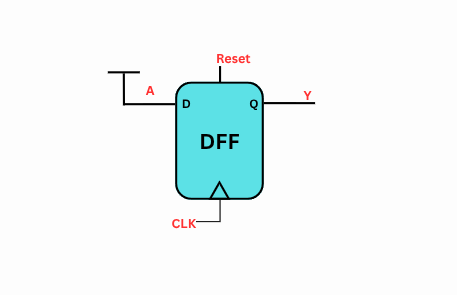
</p>

```verilog
module dff_const1(input clk, input reset, output reg q);
always @(posedge clk, posedge reset)
begin
	if(reset)
		q <= 1'b0;
	else
		q <= 1'b1;
end

endmodule
```

- A **flip-flop** is inferred (`always @(posedge clk or posedge reset)`).
- On reset → `Q = 0`
- Else → `Q = 1` (since D = 1).
- ❓ Is this a sequential constant?
    - Not exactly — because Q waits for the **next rising clock edge** before becoming `1`.

### 📉 Waveform Observation

<p align="center">
  
</p>

- Reset is asserted → `Q = 0`.
- Reset de-asserted → `Q` doesn’t change immediately.
- Only at **next clock edge**, `Q = 1`.
- 🔑 **Conclusion**: This is **not just an inverter**, it infers a **D flip-flop**.

---

## 3️⃣ Case 2 – `dff_const2.v`

- **Code Behavior**:

<p align="center">
  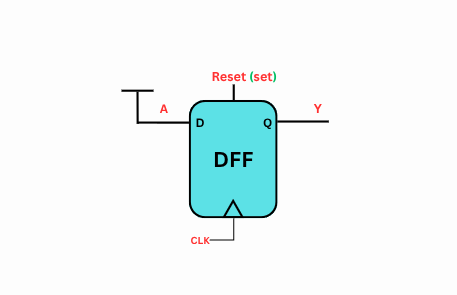
</p>


```verilog
module dff_const2(input clk, input reset, output reg q);
always @(posedge clk, posedge reset)
begin
	if(reset)
		q <= 1'b1;
	else
		q <= 1'b1;
end

endmodule
```

- Flip-flop with reset that **acts like a set**.
- On reset → `Q = 1`.
- Since D = 1 → `Q` stays `1` forever.

### 📉 Waveform Observation

<p align="center">
  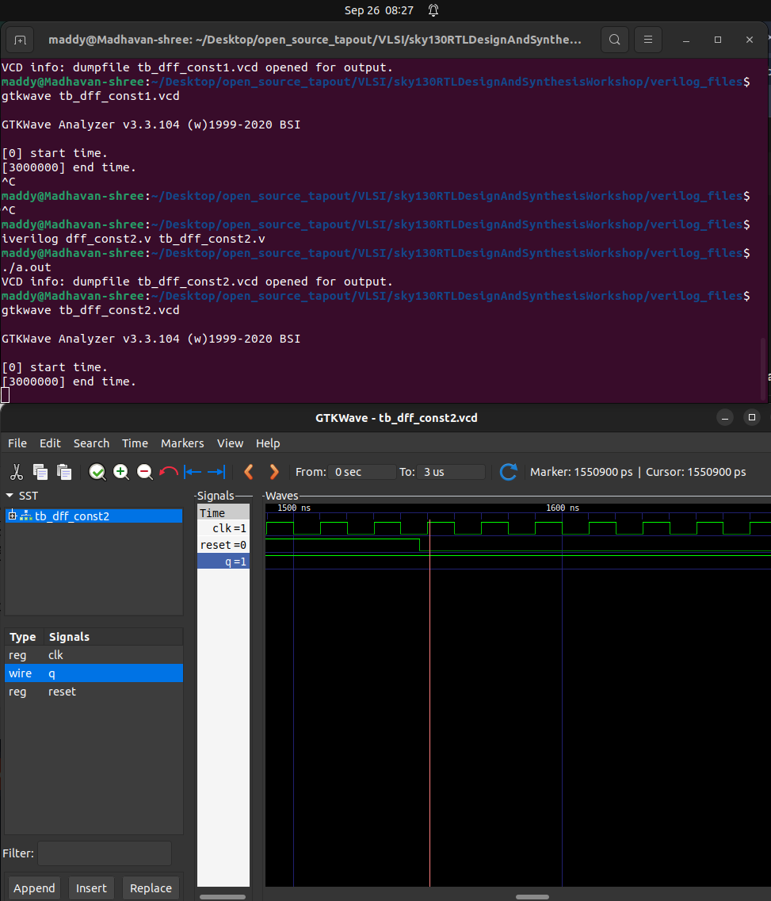
</p>

- No matter reset or clock, `Q = 1`.
- 🔑 **Conclusion**: This is a **sequential constant (always 1)**.

---

## 4️⃣ Simulation Setup 🖥️

- Compile & simulate with Icarus Verilog:

```bash
iverilog dff_const1.v tb_dff_const1.v
./a.out
gtkwave  tb_dff_const1.vcd

```

- Waveform check in GTKWave:
    - For `dff_const1` → `Q` waits for clock edge after reset.
    - For `dff_const2` → `Q` is always 1.

---

## 5️⃣ Synthesis Flow in Yosys ⚙️

🎯Steps for **`dff_const1.v`**:

```bash
yosys> read_liberty -lib ../lib/sky130_fd_sc_hd__tt_025C_1v80.lib
yosys> read_verilog dff_const1.v
yosys> synth -top dff_const1
yosys> dfflibmap -liberty ../lib/sky130_fd_sc_hd__tt_025C_1v80.lib
yosys> abc -liberty ../lib/sky130_fd_sc_hd__tt_025C_1v80.lib
yosys> show
```

<p align="center">
  
</p>

🎯Steps for **`dff_const2.v`**:

```bash
yosys> read_liberty -lib ../lib/sky130_fd_sc_hd__tt_025C_1v80.lib
yosys> read_verilog dff_const2.v
yosys> synth -top dff_const2
yosys> dfflibmap -liberty ../lib/sky130_fd_sc_hd__tt_025C_1v80.lib
yosys> abc -liberty ../lib/sky130_fd_sc_hd__tt_025C_1v80.lib
yosys> show
```

<p align="center">
  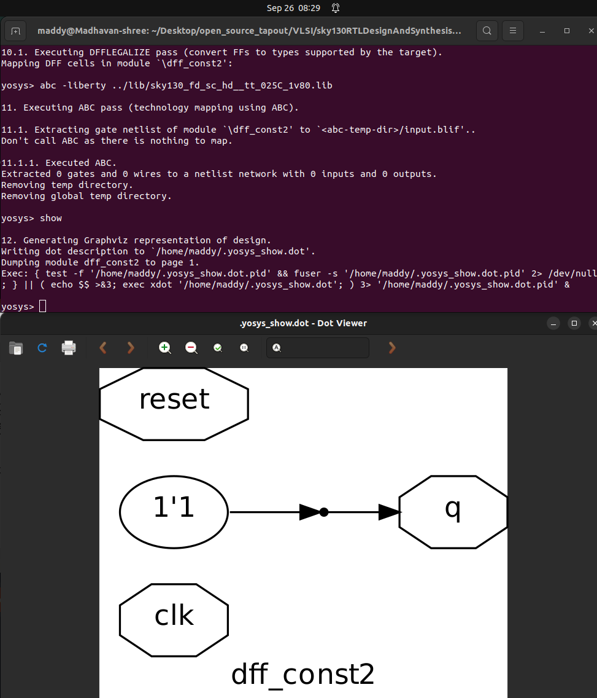
</p>

---

### 🔍 Key Observations

- `dff_const1.v`: Inferred **DFF**, output depends on clock → **not a constant**.
- `dff_const2.v`: Output always `1` → **sequential constant**.
- **Extra Step in Sequential Circuits** → `dfflibmap` ensures correct mapping of flip-flops to library cells.
- **Reset polarity mismatch** leads to insertion of an inverter by the tool.

---

# 👉 **SKY130RTL D3SK3 L2 – Lab07 Sequential Logic Optimisations (Part 2)**

---

## 🔹In previous session

- In **Const1**, a flip-flop was inferred (verified in printing statistics).
- In **Const2**:
    - No flop was inferred ✅
    - Only wires remained.
    - Since `Q = 1` always → synthesis tool optimized away the flop.

👉 **Result:** Just a constant driver → `Q = 1’b1`.

---

## 📊 Importance of Printing Statistics

- Shows how many **flops/latches/gates** are inferred after synthesis.
- Confirms whether **optimizations** were applied.
- Helps compare **different designs** and track resource usage.

<p align="center">
  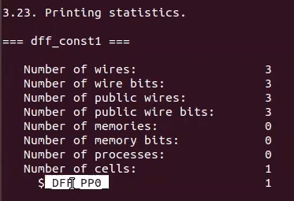
</p>
- in which there is a number of cell present and no memory 

<p align="center">
  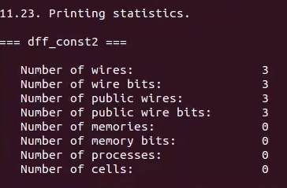
</p>
- as well as for dff_const2.v there is no memory but itt also doesn’t had the cells !

---

## 🔹 Moving to DFF Const3

This example is more interesting 🚀 

<p align="center">
  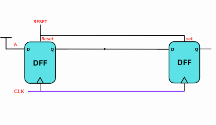
</p>

- The design has **two flops** → `Q1` and `Q`.
- Both share the **same clock and reset**.

```verilog
module dff_const3(input clk, input reset, output reg q);
reg q1;

always @(posedge clk, posedge reset)
begin
	if(reset)
	begin
		q <= 1'b1;
		q1 <= 1'b0;
	end
	else
	begin
		q1 <= 1'b1;
		q <= q1;
	end
end

endmodule
```

### Behavior:

- **Q1** → Reset flop:
    - On reset → `Q1 = 0`.
    - Next clock edge → `Q1 = 1` permanently.
- **Q** → Set flop:
    - On reset → `Q = 1`.
    - Later → samples value of `Q1` on clock edges.

---

## 🤔💭 Could we able to optimize this circuit ?

- Lets see the timing output of this circuit.

<p align="center">
  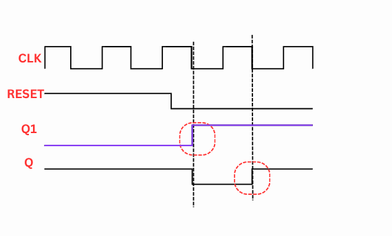
</p>

- **Reset active** → `Q1 = 0`, `Q = 1`.
- **At 1st clock edge**:
    - `Q1` updates to `1` (after `T_CQ` delay).
    - `Q` still samples old `Q1 = 0` → so `Q = 0`.
- **At 2nd clock edge**:
    - `Q1` already = `1`.
    - `Q` samples `1`.

✅ **Final Behavior**:

- `Q = 1` at reset
- Drops to `0` for **one cycle**
- Then stays `1` forever

---

## ⚡ Optimization Outcome

- ❌ Flop A (`Q1`) → **cannot be removed** (needed for timing).
- ❌ Flop B (`Q`) → **cannot be removed** (must capture intermediate 0).

👉 Both flops **remain in the circuit**, even though constants are involved.

---

# 👉 SKY130RTL D3SK3 L3 – Lab07 Sequential Logic Optimisations (Part 3)

---

## 📌 Step 1: Simulation of `dff_const3.v`

- To simulate, we use **iVerilog** and **GTKWave**:
    
    ```
    iverilog dff_const3.v tb_dff_const3.v 
    ./a.out
    gtkwave tb_dff_const3.vcd
    ```
    
- Since `Q1` is not a **primary output**, we must **pull it from the internal signals** of the Unit Under Test (UUT).
- Signals to observe:
    - `Q1` (internal reset flop)
    - `Q` (final output)

### 🖥️ Simulation Results

<p align="center">
  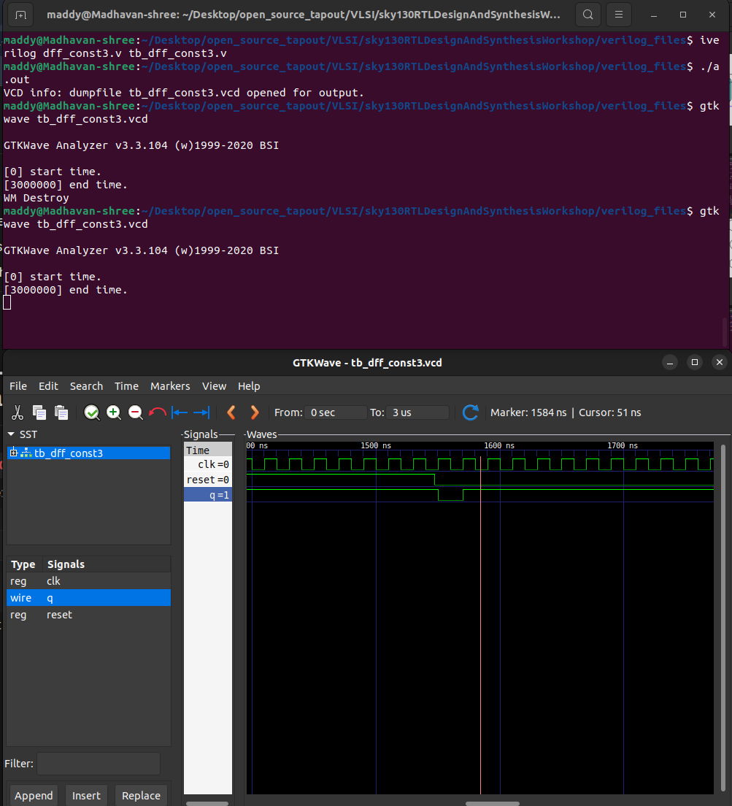
</p>

- **Reset applied** → Q1 = 0, Q = 1.
- On **first clock edge after reset**:
    - `Q1` goes **0 → 1**.
    - `Q` samples old value (0) → so **Q = 0**.
- On **next clock edge**:
    - `Q1 = 1`.
    - `Q` samples 1 → so **Q = 1** again.

✅ Observed behavior → **Q goes low for exactly one clock cycle**, aligned with Q1’s rising edge.

---

## 🔹 Step 2: Synthesis of `dff_const3`

Run synthesis flow in **Yosys**:

```
yosys> read_liberty -lib ../lib/sky130_fd_sc_hd__tt_025C_1v80.lib
yosys> read_verilog dff_const3.v
yosys> synth -top dff_const3
yosys> dfflibmap -liberty ../lib/sky130_fd_sc_hd__tt_025C_1v80.lib
yosys> abc -liberty ../lib/sky130_fd_sc_hd__tt_025C_1v80.lib
yosys> show
```

### 📊 Synthesis Outcome

<p align="center">
  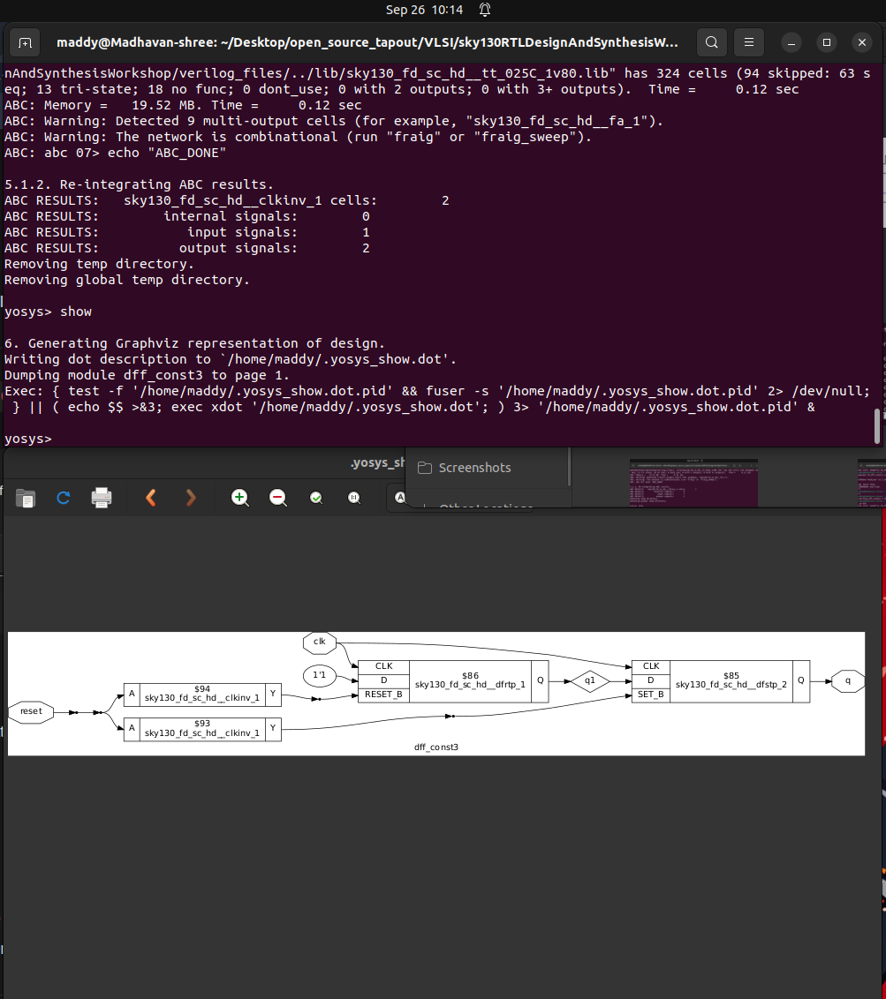
</p>
- **Two flip-flops inferred** → matches expectation.
- **Mapped standard cells**:
    - First flop → **reset flop**.
    - Second flop → **set flop**.
- **Clock** → same for both flops.
- **Connections**:
    - Output of first flop (`Q1`) → connected to **D input of second flop**.
- **Active-high reset/set** → synthesis tool inserted **inverters**, since library cells support **active-low reset/set**.

---

## 📌Simulation of `dff_const4.v`

- To simulate, we use **iVerilog** and **GTKWave**:
    
    ```
    iverilog dff_const4.v tb_dff_const4.v 
    ./a.out
    gtkwave tb_dff_const4.vcd
    ```
    

### 🖥️ Simulation Results

<p align="center">
  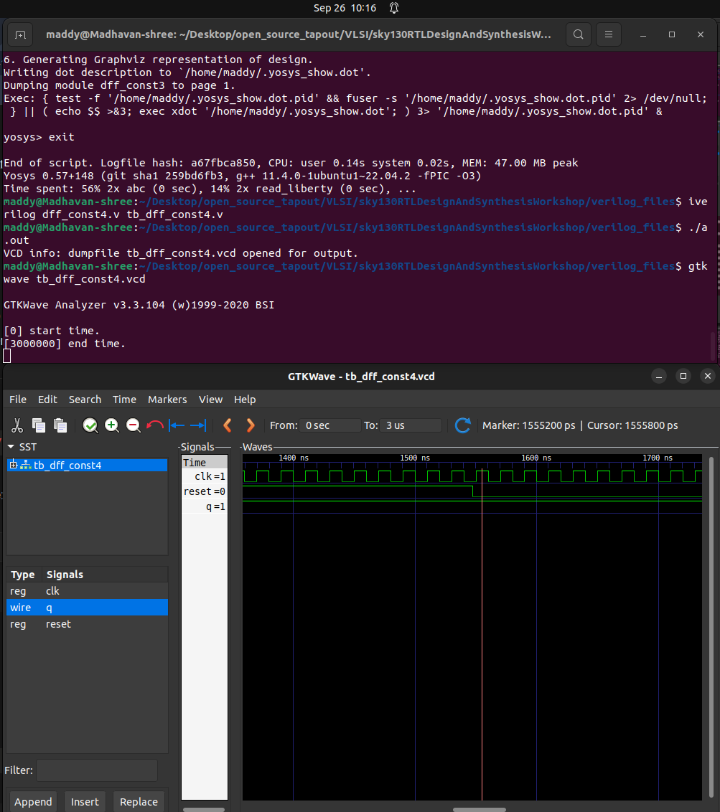
</p>

## 📊 Synthesis of `dff_const4.v`

Run synthesis flow in **Yosys**:

```
yosys> read_liberty -lib ../lib/sky130_fd_sc_hd__tt_025C_1v80.lib
yosys> read_verilog dff_const4.v
yosys> synth -top dff_const4
yosys> dfflibmap -liberty ../lib/sky130_fd_sc_hd__tt_025C_1v80.lib
yosys> abc -liberty ../lib/sky130_fd_sc_hd__tt_025C_1v80.lib
yosys> show
```

<p align="center">
  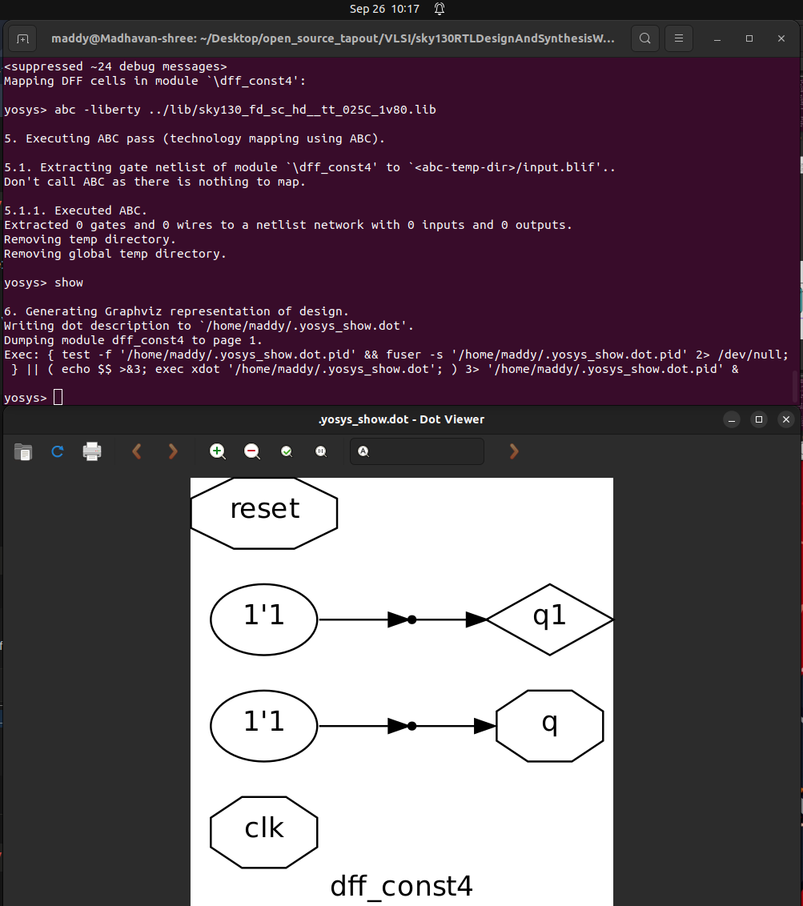
</p>

---

## 📌Simulation of `dff_const5.v`

- To simulate, we use **iVerilog** and **GTKWave**:
    
    ```
    iverilog dff_const5.v tb_dff_const5.v 
    ./a.out
    gtkwave tb_dff_const5.vcd
    ```
    

### 🖥️ Simulation Results

<p align="center">
  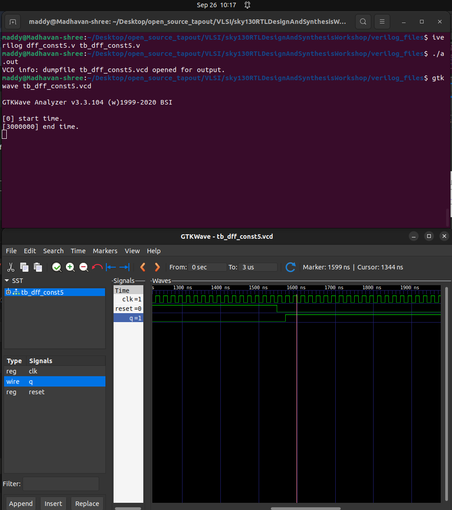
</p>

## 📊 Synthesis of `dff_const5.v`

Run synthesis flow in **Yosys**:

```
yosys> read_liberty -lib ../lib/sky130_fd_sc_hd__tt_025C_1v80.lib
yosys> read_verilog dff_const5.v
yosys> synth -top dff_const5
yosys> dfflibmap -liberty ../lib/sky130_fd_sc_hd__tt_025C_1v80.lib
yosys> abc -liberty ../lib/sky130_fd_sc_hd__tt_025C_1v80.lib
yosys> show
```

<p align="center">
  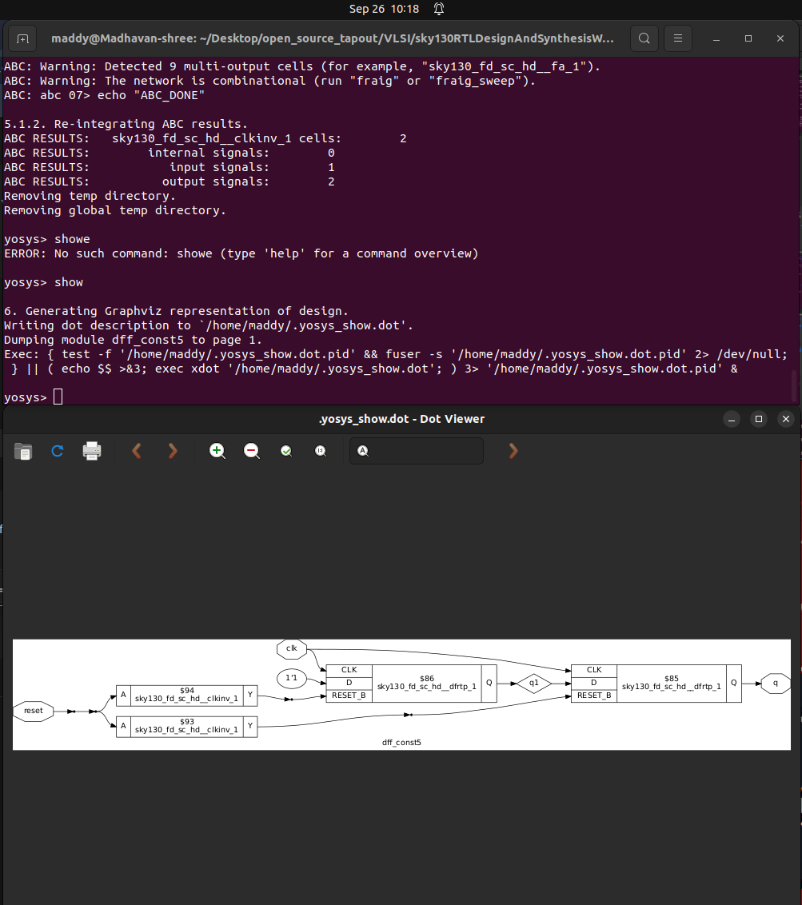
</p>

---

# 👉SKY130RTL D3SK4 L1 – Sequential Optimisation: Unused Outputs (Part 1)

---

If some internal signals or outputs do not affect the **primary output**, synthesis tools will **remove (optimise away)** that unused logic.

---

## 🔹 Example Code: `counter_opt.v`

- Inputs: **clk, reset**
- Output: **Q**
- Internal signal: **count [2:0]**

Behavior:

- On reset → `count = 0`
- Else → `count = count + 1` (3-bit up-counter)
- Output → `Q = count[0]`

<p align="center">
  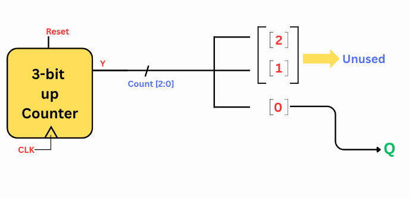
</p>
So:

- `count[2]` and `count[1]` are **unused** ❌
- Only `count[0]` matters for output ✅

---

## 🔹 Case Analysis

**Case 1:**

```
Q = count[0]
```

- Only bit0 is relevant.
- Bits1 and bit2 → unused → will be **optimised away**.

---

**Case 2:**

```
Q = (count == 3'b100)
```

- All 3 bits (`count[2:0]`) contribute to Q.
- None can be optimised away.

### 📝 Combination Table for `count == 3'b100`

| count[2] | count[1] | count[0] | Q = (count==3'b100) |
| --- | --- | --- | --- |
| 0 | 0 | 0 | 0 |
| 0 | 0 | 1 | 0 |
| 0 | 1 | 0 | 0 |
| 0 | 1 | 1 | 0 |
| 1 | 0 | 0 | 1 |
| 1 | 0 | 1 | 0 |
| 1 | 1 | 0 | 0 |
| 1 | 1 | 1 | 0 |
- Here, **all 3 bits matter** to determine output Q.
- None can be removed during synthesis.

---

## 🔹 Synthesis Flow

Steps:

```bash
read_liberty -lib ../lib/sky130_fd_sc_hd__tt_025C_1v80.lib
read_verilog counter_opt.v
synth -top counter_opt
dfflibmap -liberty ../lib/sky130_fd_sc_hd__tt_025C_1v80.lib
abc -liberty ../lib/sky130_fd_sc_hd__tt_025C_1v80.lib
show
```

### 📊 Observation

- Expected → **3 DFFs** (for 3-bit counter).
- Actual → **Only 1 DFF inferred!** 🤯

<p align="center">
  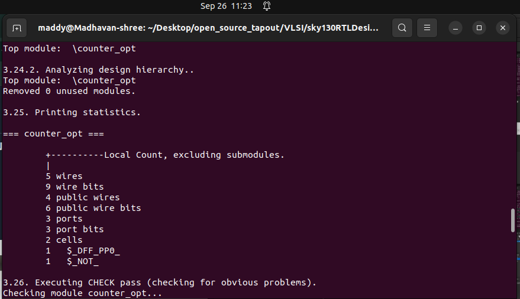
</p>
Reason:

- Only `count[0]` influences primary output Q.
- `count[1]` and `count[2]` unused → **removed**.

---

## 🔹 Circuit Simplification

Final synthesized logic:

<p align="center">
  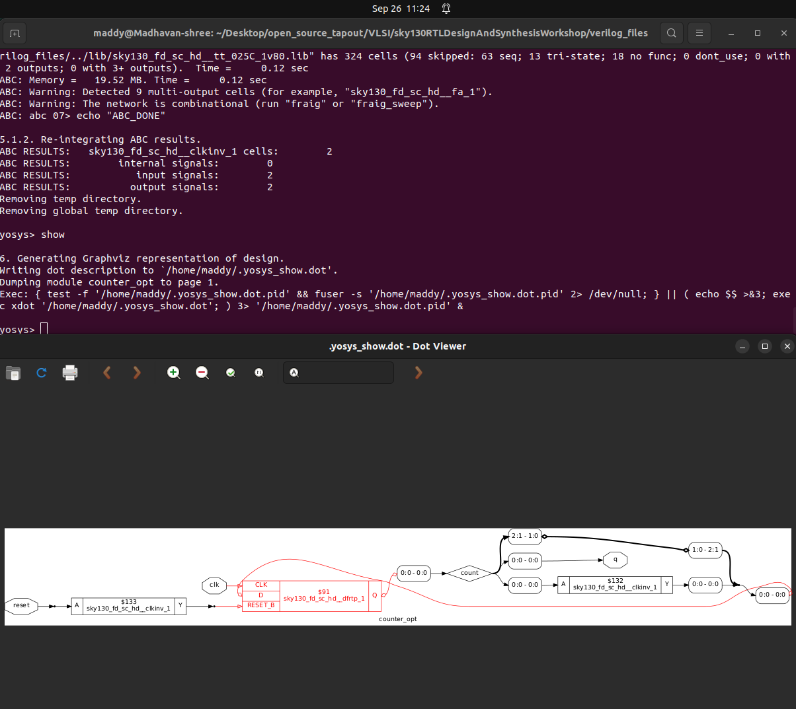
</p>

- One flip-flop with **active-low reset** (library specific).
- Inverter inserted (since RTL had active-high reset).
- **Q toggles every clock cycle**:
    - D pin driven as `~Q`.
    - So → `Q <= ~Q`.

✅ Equivalent to a **T-flip-flop** implementation.

---

# 👉SKY130RTL D3SK4 L2 – Sequential Optimisation: Unused Outputs (Part 2)

---

## 🔹 Modification in RTL

- A new RTL file was created: `counter_opt2.v`
- Change in code:
    
    ```
    Q = (count[2:0] == 3'b100);
    ```
    
- Now → **all 3 counter bits** are used.

```bash
module counter_opt (input clk , input reset , output q);
reg [2:0] count;
assign q = (count[2:0] == 3'b100);

always @(posedge clk ,posedge reset)
begin
	if(reset)
		count <= 3'b000;
	else
		count <= count + 1;
end

endmodule
```

- Expectation ✅: **3 flip-flops should be inferred**.

---

## 🔹 Synthesis Flow

Commands:

```
read_liberty -lib ../lib/sky130_fd_sc_hd__tt_025C_1v80.lib
read_verilog counter_opt2.v
synth -top counter_opt
dfflibmap -liberty ../lib/sky130_fd_sc_hd__tt_025C_1v80.lib
abc -liberty ../lib/sky130_fd_sc_hd__tt_025C_1v80.lib
show
```

### 📊 Observation

<p align="center">
  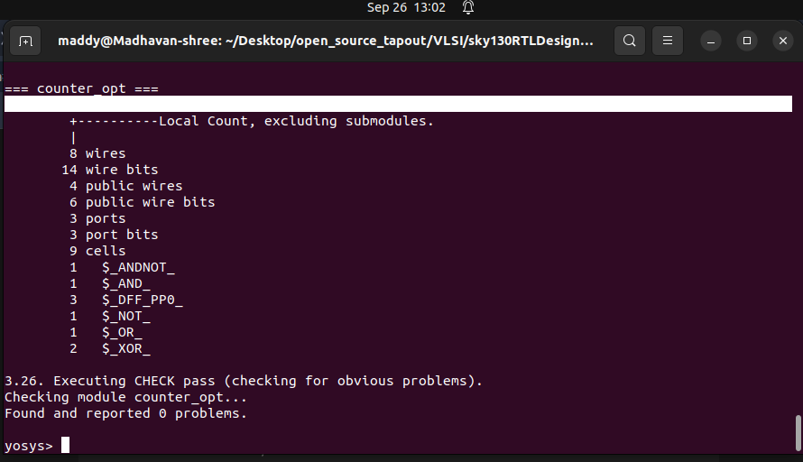
</p>

- In the previous case → only **1 flop** was inferred.
- Now → **all 3 flops are retained** (count[2], count[1], count[0]).
- Logic for incrementing is also present → because flops are in use.

image36

---

## 🔹 Q Logic Evaluation

Q is derived using a **3-input NOR gate** with one inverted input:

- `A` = count[1]
- `B` = count[0]
- `C` = count[2] (inverted input)

So expression:

```
Q = (count[0] + count[1] + count[2]’)’
```

### Applying DeMorgan’s Theorem ✍️

```
Q = count[0]’ · count[1]’ · count[2]
```

✅ Matches the required expression for `(count == 3'b100)`.

---

## 🔹 Comparison with Previous Case

**Earlier Case (Part 1):**

- Only `count[0]` was used → `Q = count[0]`.
- Result → Only 1 flop kept, others **optimised away**.

**This Case (Part 2):**

- All 3 bits (`count[2:0]`) contribute to Q.
- Result → All 3 flops retained ✅.
- Incrementing logic (adder-like structure) also preserved.

---

## 🔹 Key Insight 💡

- If outputs are **unused**, synthesis tool removes:
    - Flops corresponding to unused signals.
    - Logic feeding those flops.
- If outputs are **used in final expression**, all required flops + logic are **preserved**.

---
# 👉 Vist the [DAY4](https://github.com/madhavanshree2006/RISC-V-SoC-Tapeout_Week-1/tree/main/DAY3) 🤩

# Thank you 🤗
