<h1 align="center">🌟 RISC-V SoC Tapeout – Week 1️⃣</h1>
<br><br>

<h2 align="center">🚀 Day 3 -GLS, blocking vs non-blocking and Synthesis-Simulation mismatch</h2>
<br>


# 🚀 SKY130RTL D4SK1 L1 – GLS Concepts and Flow using iVerilog

## 🔹 What is GLS?

- **GLS = Gate Level Simulation**
- At RTL stage → we validate design functionality with a **testbench**.
- For GLS → instead of RTL, we plug the **netlist** into the testbench.
- The **netlist** = logically equivalent to RTL, but expressed using **standard cells**.
- ✅ Inputs/Outputs remain same → so the netlist can seamlessly replace the RTL in the testbench.

---

## 🔹 Why Run GLS?

1. **Logical Correctness after Synthesis**
    - Need to confirm that synthesis didn’t change functionality.
2. **Timing Validation**
    - RTL sim ignores **setup/hold timing**.
    - Real silicon requires timing checks → hence GLS (with delay annotation).

⚡ Note: In this session, we focus on **functional GLS** (not timing-aware GLS).

---

## 🔹 GLS Flow with iVerilog

Normal RTL simulation flow:

```
Design (RTL) + Testbench → iVerilog → VCD → GTKWave
```

Gate-Level Simulation flow:

```
Netlist (Post-Synth) + Testbench + Gate-Level Models → iVerilog → VCD → GTKWave
```

<p align="center">
  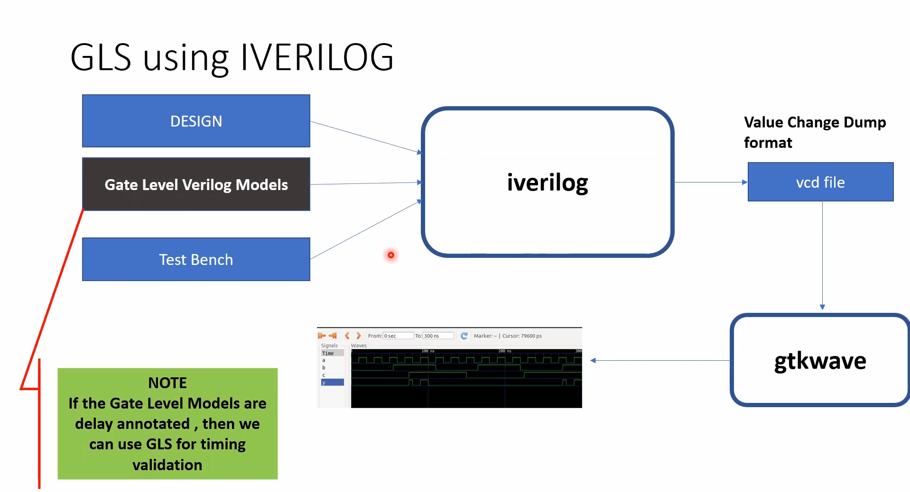
</p>


✨ Extra step: **Gate-Level Verilog Models** must be provided → so iVerilog knows what cells like `AND2`, `DFF_X1`, etc., actually mean.

---

## 🔹 Role of Gate-Level Models

- Define **meaning of standard cells** (AND, OR, DFF, etc.).
- Can be:
    - **Functional only** → checks logic correctness.
    - **Timing-aware** → checks both logic + setup/hold timing.

📌 In this lab → using **functional GLS models**.

---

## 🔹 Example Transformation

<p align="center">
  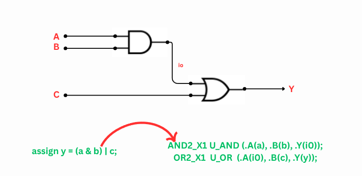
</p>

👉 RTL Code:

```verilog
assign y = (a & b) | c
```

👉 After Synthesis (Netlist fragment):

```verilog
AND2_X1 U_AND (.A(a), .B(b), .Y(i0));
OR2_X1  U_OR  (.A(i0), .B(c), .Y(y));
```

- Here, `AND2_X1` and `OR2_X1` are **cells**.
- Their true meaning comes from **gate-level Verilog models**.

---

## 🔹 Why Validate the Netlist?

Even though synthesis is supposed to preserve functionality → mismatches **can occur**.

- **Synthesis-Simulation Mismatch** = functional difference between RTL sim and GLS.
- Common causes include → coding style, latches, or unsupported constructs.

Hence:

✅ GLS ensures the **netlist is functionally equivalent** to RTL.

---

# 🚀 SKY130RTL D4SK1 L2 SynthesisSimulationMismatch

## ⚡ Why do mismatches happen?

Synthesis vs Simulation mismatch can occur due to:

- ❌ **Missing sensitivity list**
- ⚡ **Blocking vs Non-blocking assignments**
- ⚠️ **Non-standard Verilog coding**

👉 Let’s dive into **missing sensitivity list**.

---

## 🛠️ How does a simulator work?

- Simulator works based on **activity**.
- Output updates **only when inputs change**.
- Example: For an AND gate `y = a & b`
    - If `a` or `b` changes → `y` updates.
    - If no input changes → `y` stays the same.

---

## 🧩 Example: 2x1 MUX (Wrong Code)

```verilog
always @(sel) begin
  if (sel)
    y = i1;
  else
    y = i0;
end
```

### 🔍 What’s wrong here?

- The block is **only sensitive to `sel`**.
- Changes in `i0` or `i1` are **ignored** unless `sel` toggles.

<p align="center">
  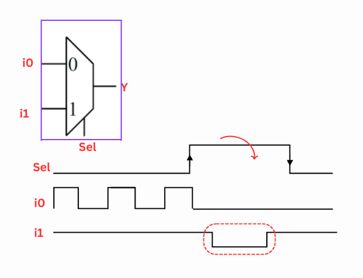
</p>

### 📉 Simulation Behavior

- When `sel=0` → `y` should follow `i0`.
- But since `i0` is not in sensitivity list → changes in `i0` won’t update `y`.
- Looks like **`y` is a latch** or like a **double-edge triggered flop**.

---

## ✅ Correct Way (Using )

```verilog
always @(*) begin
  if (sel)
    y = i1;
  else
    y = i0;
end
```

### 🎯 Why this works?

- `@(*)` → means **always react to any signal used inside the block** (`sel`, `i0`, `i1`).
- Now → changes in `i0`, `i1`, or `sel` will all update `y`.

---

## 🔄 Synthesis vs Simulation

- **RTL Simulation (with wrong sensitivity list):**
    - Behaves like latch/double-edge flop.
- **Synthesis Result:**
    - Synthesizer ignores sensitivity list.
    - Builds the correct **MUX**.
- ✅ Hence, **mismatch arises** → RTL sim ≠ Synthesized netlist sim.

---

# 🚀SKY130RTL D4SK1 L1 – GLS Concepts and Flow Using Iverilog

## ⚡ Blocking vs Non-Blocking in Verilog

### 🔹 1. Where does this matter?

- These concepts apply **inside `always` blocks** only.
- The difference arises in **how assignments are executed**.

---

### 🔹 2. Blocking Statements (`=`)

- Written using **equal to (`=`)**.
- Execution is **sequential** (line by line, in written order).
- Behavior is **similar to C programming**.

👉 Example:

```
a = b & c;
e = a & d;
```

Here, `a` is assigned first, then `e` is evaluated using the **new value** of `a`.

---

### 🔹 3. Non-Blocking Statements (`<=`)

- Written using **less than equal to (`<=`)**.
- Execution is **parallel** – order doesn’t matter.
- RHS (right-hand side) expressions are **all evaluated first**, then assignments happen.

👉 Example:

```
a <= b & c;
e <= a & d;
```

Both are evaluated in parallel → order of writing doesn’t affect results.

---

### 🔹 4. Why is this dangerous? 🚨

- Misuse of **blocking** can lead to creating unintended hardware.
- Order of statements **matters a lot** with blocking.

---

## 🌀 Case Study: Shift Register Example

### ✅ Aim:

- Design a **2-flop shift register**.
- On reset → both flops = 0.
- Input: `D` → goes to `Q0` → shifts to `Q`.

<p align="center">
  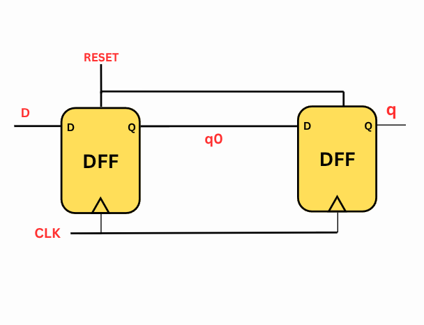
</p>

---

### 📌 Case 1: Using Blocking (`=`) – Correct Order

```
Q = Q0;
Q0 = D;
```

- First `Q0` → `Q`.
- Then `D` → `Q0`.
- Hardware = **two flops**. (Correct ✅)

---

### 📌 Case 2: Using Blocking (`=`) – Wrong Order

```
Q0 = D;
Q = Q0;
```

- First `D` → `Q0`.
- Then `Q0` → `Q`. (But now `Q0` already has `D`)
- Hardware = **only one flop**. ❌ Serious Problem!

---

### 🛑 The Takeaway

- **Blocking (`=`)** executes in order → risky for sequential logic.
- **Non-Blocking (`<=`)** is safer for modeling flops since updates happen in parallel.

💡 **Rule of Thumb:**

👉 Use **non-blocking (`<=`)** for sequential logic (flops).

👉 Use **blocking (`=`)** for combinational logic.

---

---

# 🚀SKY130RTL D4SK1 L4 – Caveats with Blocking Statements

## ⚡ The Problem with Blocking Statements (`=`)

### 🔹 1. Quick Recap

- Blocking (`=`) executes **in order** (line by line).
- This can cause **unexpected simulation results**.
- Especially dangerous when you **intend combinational logic** but simulation shows **extra delay/flop-like behavior**.

---

## 🌀 Case Study 1 – Wrong Order

👉 **Code:**

```verilog
module code (input a, b, c, output reg y);
  reg q0;
  always @(*) begin
    y  = q0 & c;   // uses OLD value of q0 ❌
    q0 = a | b;    // q0 updated only AFTER
  end
endmodule
```

### 🔍 What happens?

- `y` is assigned **before** `q0` is updated.
- So simulation uses the **old value of `q0`**.
- Looks as if there is a **hidden flop** (1-cycle delay).
- ⚠️ But in **synthesis**, there is **no flop** → mismatch!

---

## 🌀 Case Study 2 – Correct Order

👉 **Code:**

```verilog
module code (input a, b, c, output reg y);
  reg q0;
  always @(*) begin
    q0 = a | b;    // update q0 first ✅
    y  = q0 & c;   // now uses NEW q0 value
  end
endmodule
```

### 🔍 What happens?

- `q0` is computed **first**.
- `y` now gets the **latest value of q0**.
- Simulation matches expected behavior.
- ✅ Still, synthesis for both codes gives the same circuit.

---

## ⚠️ The Big Issue – Simulation vs Synthesis Mismatch

- **Simulation (Case 1):** Looks like an **extra flop/delay**.
- **Simulation (Case 2):** Works correctly.
- **Synthesis (Both):** Same circuit → no flop!

👉 This creates **confusion & mismatches**.

---

## Why GLS is Important

- Ensures the **netlist behavior** matches the **expected RTL simulation**.
- Helps catch **blocking vs non-blocking pitfalls**.
- Prevents nasty surprises in silicon 😅

---

# 🚀SKY130RTL D4SK2 L1 – Lab: GLS & Synth-Sim Mismatch Part 1

## 🔹 Recap from Previous Session

To run GLS, we need three things:

1. **Netlist** – synthesized design.
2. **Verilog models of standard cell libraries** – tells the simulator what each cell means.
3. **Test bench** – provides stimulus and checks output.

Flow:

```
iVerilog → VCD file → GTKWave → Observe Waveforms
```

---

## 🛠 Lab Setup – Files Used

- RTL Verilog file: `ternary_operator.v`
- Test bench: `tb_ternary_operator.v`
- Standard cell Verilog models: inside `my_lib/verilog_models/`

---

## 💡 Ternary Operator in Verilog

- Symbol: `? :`
- Syntax:

```verilog
assign y = (condition) ? value_if_true : value_if_false;
```

- Example – 2x1 MUX:

```verilog
module ternary_operator_mux (input i0 , input i1 , input sel , output y);
	assign y = sel?i1:i0;
	endmodule
```

✅ **Behavior:**

- If `select = 0` → `y = i0`
- If `select = 1` → `y = i1`

---

## ⚡ Step 1: RTL Simulation

- Run iVerilog with RTL and test bench.
- Open VCD in GTKWave.

```bash
iverilog ternary_operator_mux.v tb_ternary_operator_mux.v 
./a.out
gtkwave tb_ternary_operator_mux.vcd
```

- Observations:

<p align="center">
  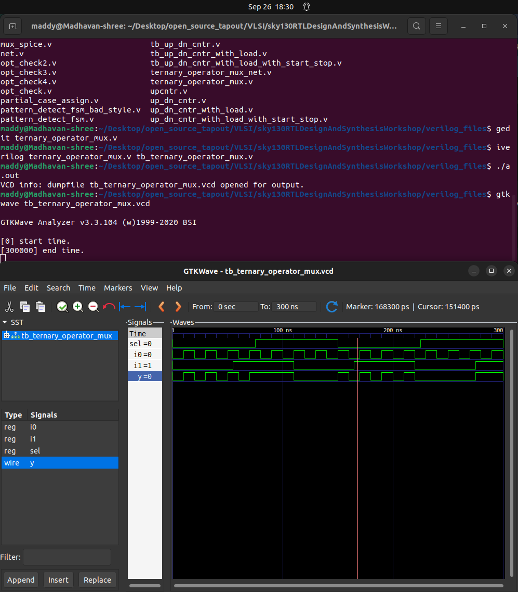
</p>

- Signals: `i0`, `i1`, `select`, `y`.
- Behavior matches expected **2x1 MUX** functionality.
- No standard cell names (like `_1_`, `_2_`) are visible → purely RTL.

---

## ⚡ Step 2: Synthesis with Yosys

- Commands used:

```bash
read_liberty -lib ../lib/sky130_fd_sc_hd__tt_025C_1v80.lib
read_verilog ternary_operator_mux.v
synth -top ternary_operator_mux
abc -liberty ../lib/sky130_fd_sc_hd__tt_025C_1v80.lib
write_verilog -noattr ternary_operator_mux_net.v
show
```

- Observation:

<p align="center">
  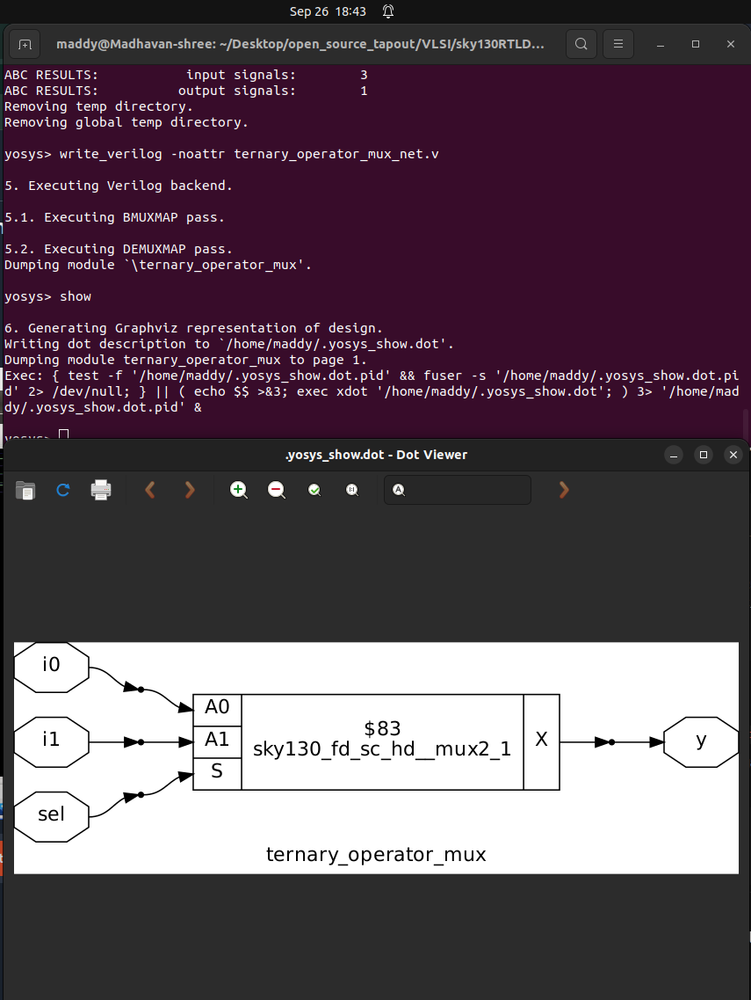
</p>

- Netlist created (`ternary_operator_mux_net.v`)
- 2x1 MUX realized using **NAND + Inverter gates**
- Boolean equation matches RTL:
    
    ```
    y = (select & i1) + (~select & i0)
    ```
    

---

## ⚡ Step 3: GLS (Gate-Level Simulation)

- Read **standard cell Verilog models**:
    - Path: `my_lib/verilog_models/`

```bash
iverilog ../my_lib/verilog_model/primitives.v ../my_lib/verilog_model/sky130_fd_sc_hd.v ternary_operator_mux_net.v tb_ternary_operator_mux.v
./a.out
gtkwave tb_ternary_operator_mux.vcd
```

- Read **netlist**: `ternary_operator_mux_net.v`
- Read **test bench**: `tb_ternary_operator_max.v`
- Run iVerilog → generate VCD → open in GTKWave.

### 🔹 Observations:

<p align="center">
  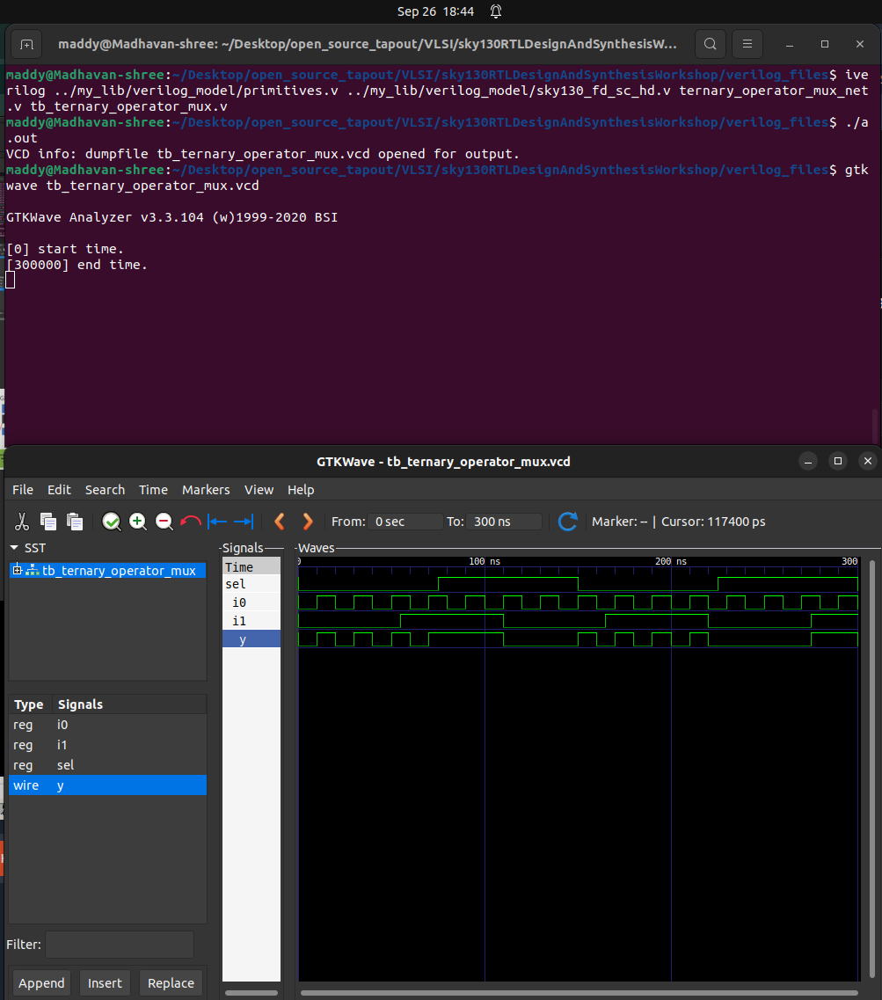
</p>

- Signals now show standard cell instances: `_6_`, `_7_`, `_8_` …
- `i0`, `i1`, `select`, `y` still behave as expected.
- GLS confirms **MUX logic is correctly implemented at gate le**

---

# 🚀SKY130RTL D4SK2 L2 – Lab: GLS & Synth-Sim Mismatch (Part 2)

### 🎯 Demonstrate **Synthesis–Simulation Mismatch** using a *bad MUX* design.

---

## 📝 The Setup

- File used: `bad_mux.v`
- Testbench: `tb_bad_mux.v`

### 🔹 RTL Design (badmux.v)

```verilog
module bad_mux (input i0 , input i1 , input sel , output reg y);
always @ (sel)
begin
	if(sel)
		y <= i1;
	else 
		y <= i0;
end
endmodule
```

⚠️ Problem → Sensitivity list only has `sel`.

This causes **simulation mismatch** because changes in `i0` or `i1` are not detected unless `sel` toggles.

---

## ⚡ Step 1: RTL Simulation

- Command:

```bash
iverilog bad_mux.v tb_bad_mux.v
./a.out
gtkwave tb_bad_mux.vcd
```

### 🔎 Observations:

<p align="center">
  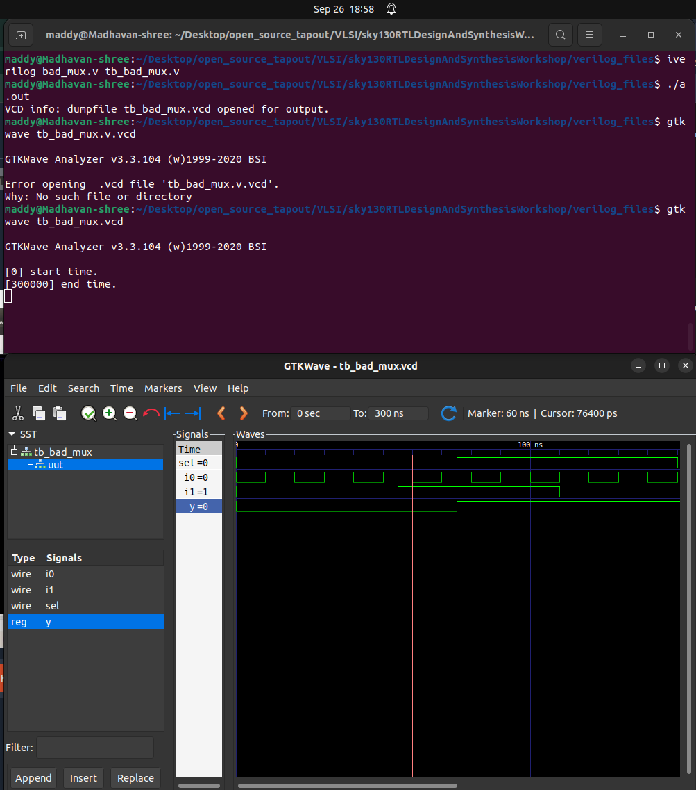
</p>

- Waveform shows **flop-like behavior**:
    - When `sel = 0`, `i0` changes are **ignored** until `sel` toggles.
    - When `sel = 1`, `i1` changes are **ignored** until `sel` toggles.
- Output `y` only updates **on select changes** → not a true MUX.

👉 Looks like a *flop*, not a *mux*!

---

## ⚡ Step 2: Synthesis with Yosys

Commands:

```bash
read_liberty -lib ../lib/sky130_fd_sc_hd__tt_025C_1v80.lib
read_verilog bad_mux.v
synth -top bad_mux
abc -liberty ../lib/sky130_fd_sc_hd__tt_025C_1v80.lib
write_verilog -noattr bad_mux_net.v
show
```

<p align="center">
  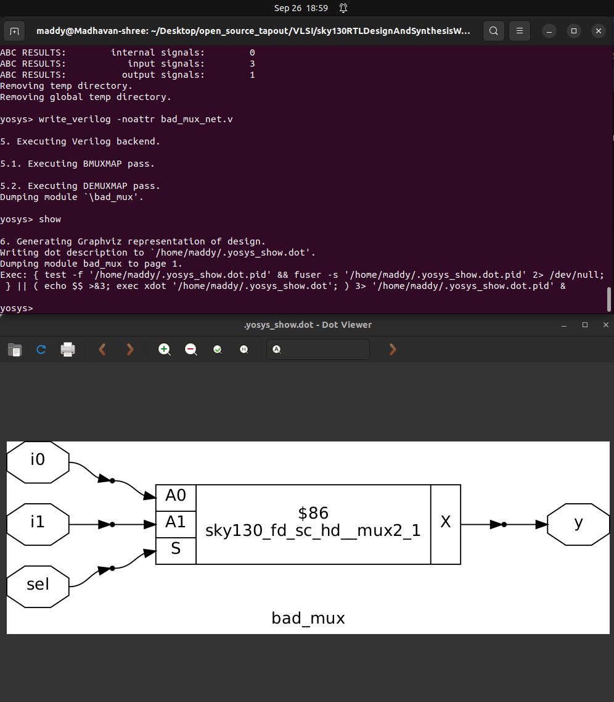
</p>

- Netlist (`bad_mux_net.v`) shows:
    - Logic inferred correctly as a **MUX**.
    - No latch/flop behavior in netlist. ✅

---

## ⚡ Step 3: GLS (Gate-Level Simulation)

Commands:

```bash
iverilog ../my_lib/verilog_model/primitives.v ../my_lib/verilog_model/sky130_fd_sc_hd.v bad_mux_net.v tb_bad_mux.v
./a.out
gtkwave tb_bad_mux.vcd
```

### 🔎 Observations:

<p align="center">
  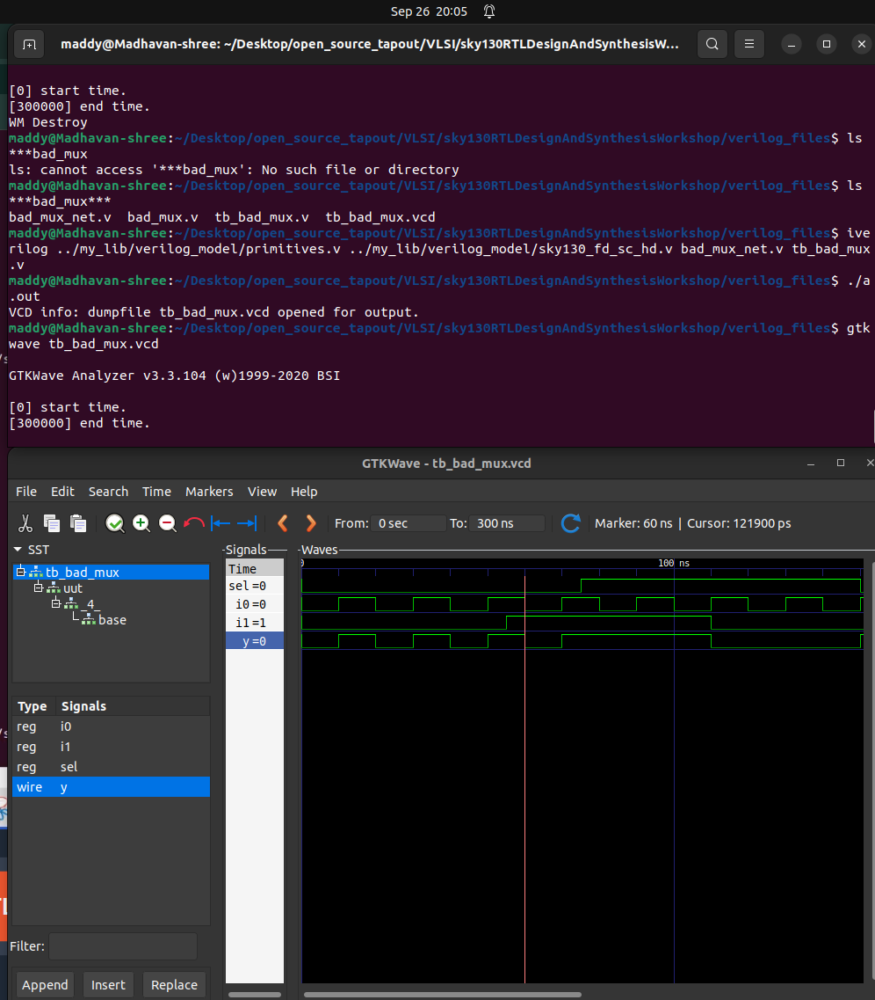
</p>

- GLS shows **true MUX behavior**:
    - When `sel = 0`, output `y` follows `i0`.
    - When `sel = 1`, output `y` follows `i1`.
- Instances like `_678_` confirm GLS netlist simulation.

---

## 🆚 Comparing RTL vs GLS

<p align="center">
  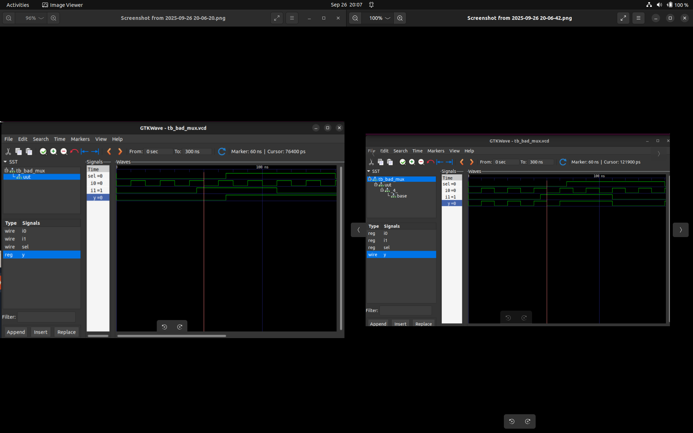
</p>
| Case | RTL (Bad Sensitivity List) | GLS (Synthesis Output) |
| --- | --- | --- |
| `sel = 0` | `i0` changes **ignored** unless `sel` toggles | `y` follows `i0` correctly |
| `sel = 1` | `i1` changes **ignored** unless `sel` toggles | `y` follows `i1` correctly |
| Behavior | Looks like a **flop** | Works as a **MUX** ✅ |

---

# 🚀 SKY130RTL D4SK3 L1 – Lab: Synth-Sim Mismatch (Blocking Statement Part 1)

### 🎯 Lets **synthesis–simulation mismatch** caused by **blocking statements** in Verilog.

## 📝 Aim of the Code

We want to implement the logic:

<p align="center">
  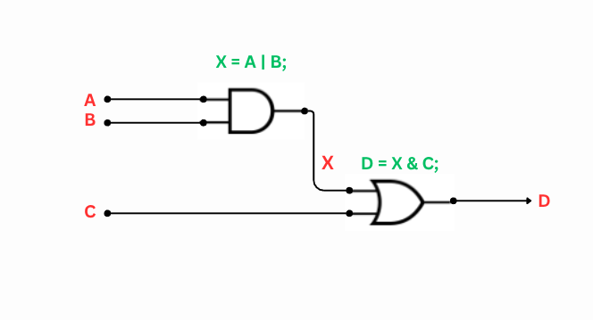
</p>

D=(A∨B)∧CD = (A \lor B) \land C

D=(A∨B)∧C

- Intermediate signal: `X = A | B`
- Final output: `D = X & C`

---

## 💻 The Verilog Code (`blocking_caveat.v`)

```verilog
module blocking_caveat(input A, B, C, output reg D);
  reg X;
  always @(*) begin
    D = X & C;     // uses old X
    X = A | B;     // X updated later
  end
endmodule
```

⚠️ Problem:

- Since **blocking assignments (`=`)** execute sequentially:
    1. `D = X & C;` executes **first**.
    2. `X = A | B;` executes **later**.
- So, when `D` is computed, it uses the **old value of `X`**, not the new one.
- Simulation makes it **look like `X` is flopped** → leading to mismatch.

---

## ⚡ Step 1: RTL Simulation

### 🔹 Commands

```bash
iverilog blocking_caveat.v tb_blocking_caveat.v
./a.out
gtkwave tb_blocking_caveat.vcd
```

### 🔎 Observations (RTL Waves)

<p align="center">
  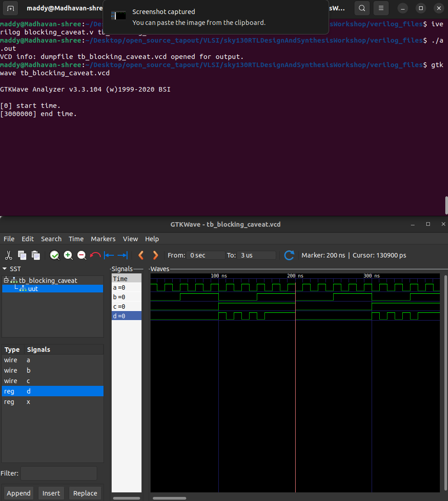
</p>


- Signals: `A, B, C, D`
- **Mismatch examples:**
    - Case 1: `A=0, B=0, C=1`
        - Expected: `D = (A|B)&C = 0`
        - Observed: `D = 1` (from old value of `X`)
    - Case 2: `A=1, C=1`
        - Expected: `D = 1`
        - Observed: `D = 0`

👉 Clearly, simulation is using the **past value of `X`**, as if `X` was flopped.

---

# SKY130RTL D4SK3 L2 – Lab: Synth-Sim Mismatch (Blocking Statement Part 2)

## ⚡ Step 1: Synthesis

### 🔹 Commands Used

```bash
read_liberty -lib ../lib/sky130_fd_sc_hd__tt_025C_1v80.lib
read_verilog blocking_caveat.v
synth -top blocking_caveat
abc -liberty ../lib/sky130_fd_sc_hd__tt_025C_1v80.lib
write_verilog -noattr blocking_caveat_net.v
show
```

<p align="center">
  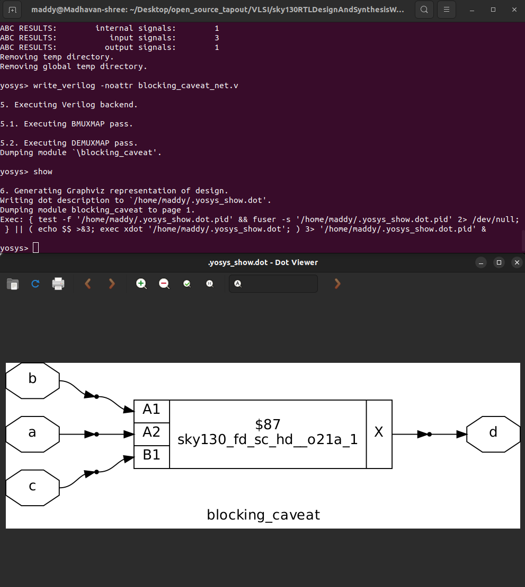
</p>

### 🔎 Netlist View

- Netlist shows **pure combinational logic** → No latch, no flop.
- Logic:

D=(A∨B)∧CD = (A \lor B) \land C

D=(A∨B)∧C

- Mapping:
    - A1, A2 → Inputs A and B
    - Output of OR gate → ANDed with C
- ✅ No “past value” dependency → Hardware evaluates instantaneously.

---

## ⚡ Step 2: Gate-Level Simulation (GLS)

### 🔹 Commands Used

```bash
iverilog ../my_lib/verilog_model/primitives.v ../my_lib/verilog_model/sky130_fd_sc_hd.v blocking_caveat_net.v tb_blocking_caveat.v
./a.out
gtkwave tb_blocking_caveat.vcd
```

### 🔎 Observations (GLS Waves)

<p align="center">
  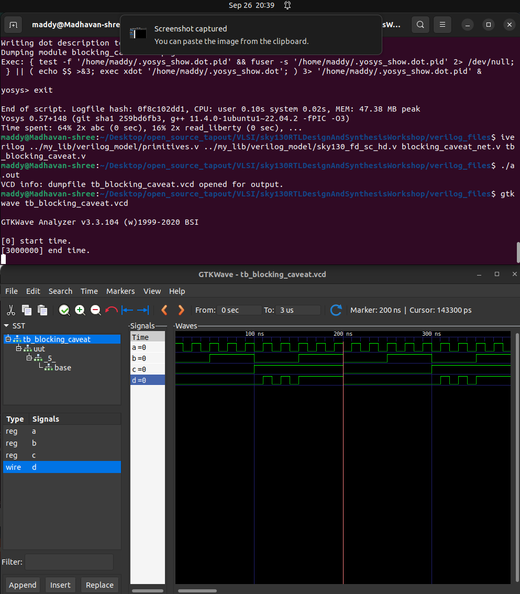
</p>


- Output `D` matches the intended logic:
    - `D = (A | B) & C` always ✅
- No flop-like behavior observed.

---

## 🆚 Comparison

<p align="center">
  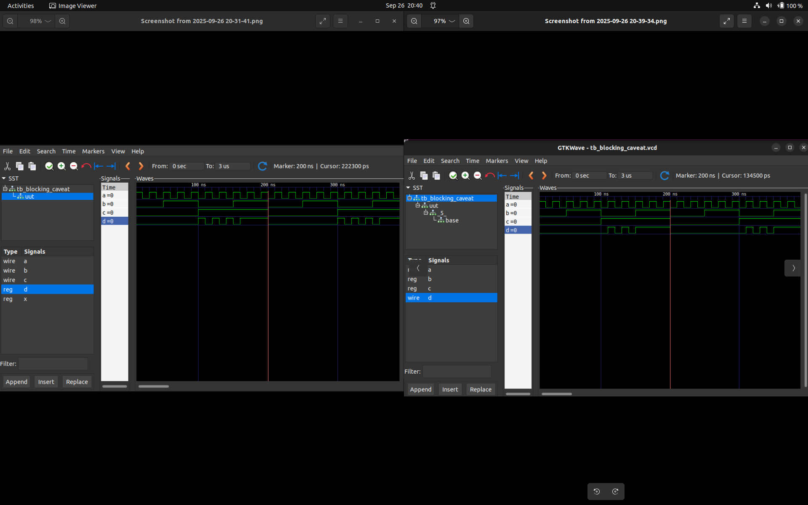
</p>

| Condition | Expected | RTL Simulation (Blocking Issue) | GLS (Correct Hardware) |
| --- | --- | --- | --- |
| A=0, B=0, C=1 | D=0 | D=1 ❌ | D=0 ✅ |
| A=1, C=1 | D=1 | D=0 ❌ | D=1 ✅ |

---
